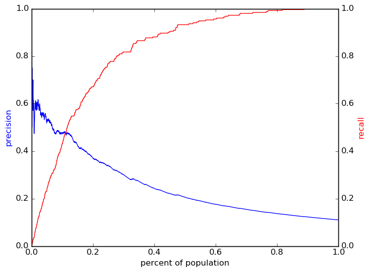
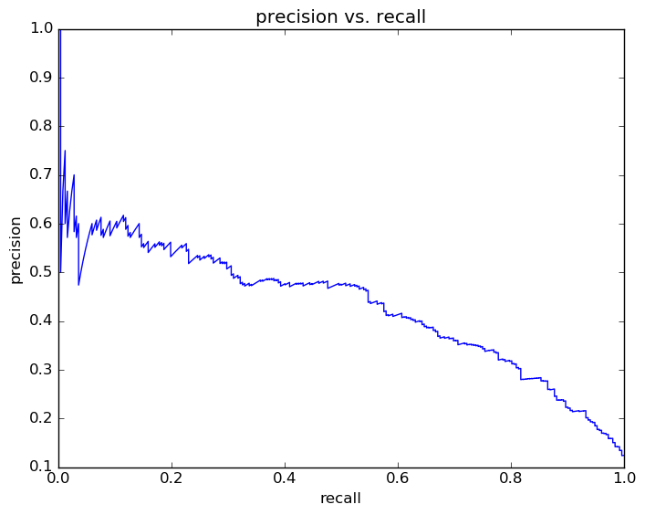
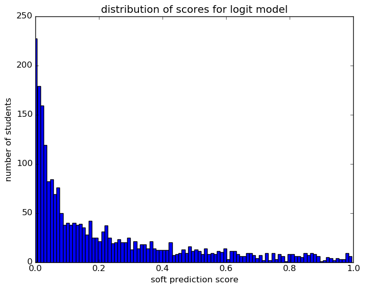
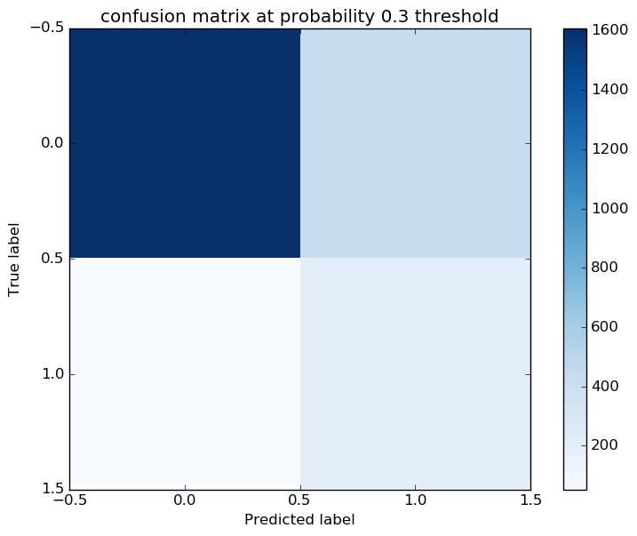

# Report for 08 17 2016 grade 10 param set 22 logit
fourth pass for grade 10

### Model Options
* label used: definite_plus_ogt
* prediction grade: 10
* validation cohorts: 2012
* test cohorts: 2013
	 * 252 positive examples, 2034 negative examples
* train cohorts: 2007, 2008, 2009, 2010, 2011
	 * 493 postive examples, 4952 negative examples
* parameter choices
	 * penalty = l2
	 * C = 0.1
* cross-validation scores: k fold, with 5 folds
	 * custom_precision_5_15 score: 0.36
	 * custom_recall_5_15 score: 0.39
* imputation strategy: median plus dummies
* scaling strategy: robust

### Features Used
* snapshots
	 * special_ed_gr_9
	 * disability_gr_9
	 * discipline_incidents_gr_9
	 * gifted_gr_9
	 * disadvantagement_gr_9
	 * status_gr_9
	 * oss_gr_9
	 * district_gr_9
	 * iss_gr_9
	 * limited_english_gr_9
	 * section_504_plan_gr_9
* absence
	 * tardy_gr_9
	 * absence_unexcused_gr_9
	 * tardy_unexcused_gr_9
	 * absence_gr_9
* oaa_normalized
	 * science_normalized_gr_8
	 * math_normalized_gr_4
	 * math_normalized_gr_5
	 * read_normalized_gr_5
	 * socstudies_normalized_gr_5
	 * science_normalized_gr_5
	 * math_normalized_gr_7
	 * read_normalized_gr_6
	 * read_normalized_gr_7
	 * math_normalized_gr_8
	 * read_normalized_gr_3
	 * math_normalized_gr_6
	 * math_normalized_gr_3
	 * read_normalized_gr_4
	 * read_normalized_gr_8
* grades
	 * gpa_gr_9
	 * gpa_district_gr_9
* demographics
	 * ethnicity
	 * gender

### Performance Metrics
on average, model run in 0.10 seconds (12 times)   metrics on the test set:  precision on top 15%: 0.424  precision on top 10%: 0.4781  precision on top 5%: 0.5263  recall on top 15%: 0.5754  recall on top 10%: 0.4325  recall on top 5%: 0.2381   metrics on the validation set:  precision on top 15%: 0.4217  precision on top 10%: 0.4856  precision on top 5%: 0.5769  recall on top 15%: 0.5238  recall on top 10%: 0.4008  recall on top 5%: 0.2381  AUC value is: 0.862  top features: status_gr_9_active (-0.74), gpa_gr_9 (-0.63), gpa_district_gr_9 (-0.54)

