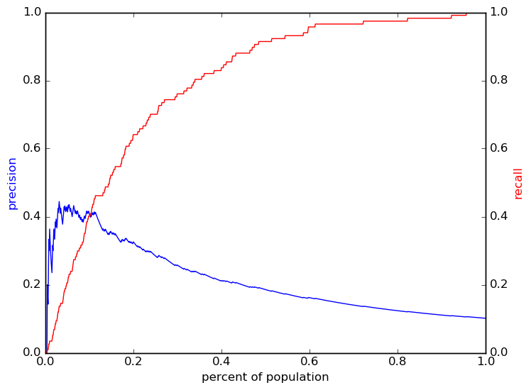

# Report for 08 17 2016 grade 7 param set 17 RF
fourth pass for grade 7

### Model Options
* label used: definite_plus_ogt
* prediction grade: 7
* validation cohorts: 2009
* test cohorts: 2010
	 * 117 positive examples, 1036 negative examples
* train cohorts: 2008
	 * 89 postive examples, 808 negative examples
* parameter choices
	 * min_samples_split = 3
	 * max_features = log2
	 * n_estimators = 1000
	 * criterion = gini
	 * max_depth = 20
* cross-validation scores: k fold, with 5 folds
	 * custom_precision_5_15 score: 0.3
	 * custom_recall_5_15 score: 0.27
* imputation strategy: median plus dummies
* scaling strategy: robust

### Features Used
* absence
	 * tardy_gr_5
	 * tardy_wkd_2_gr_5
	 * tardy_consec_gr_5
	 * tardy_wkd_2_gr_6
	 * absence_wkd_4_gr_5
	 * tardy_wkd_1_gr_6
	 * absence_unexcused_gr_5
	 * tardy_wkd_1_gr_5
	 * absence_gr_6
	 * tardy_wkd_5_gr_6
	 * tardy_unexcused_gr_6
	 * tardy_consec_gr_6
	 * absence_wkd_3_gr_6
	 * absence_wkd_5_gr_6
	 * absence_gr_5
	 * absence_wkd_5_gr_5
	 * absence_unexcused_gr_6
	 * absence_wkd_1_gr_6
	 * tardy_wkd_3_gr_6
	 * medical_gr_6
	 * absence_wkd_3_gr_5
	 * absence_wkd_2_gr_6
	 * tardy_wkd_4_gr_5
	 * tardy_wkd_3_gr_5
	 * absence_consec_gr_5
	 * tardy_unexcused_gr_5
	 * absence_wkd_4_gr_6
	 * tardy_gr_6
	 * medical_gr_5
	 * absence_wkd_1_gr_5
	 * absence_consec_gr_6
	 * tardy_wkd_5_gr_5
	 * absence_wkd_2_gr_5
	 * tardy_wkd_4_gr_6
* intervention
	 * vocational_gr_6
	 * titlei_gr_6
	 * post_secondary_gr_5
	 * atheletics_gr_6
	 * placement_gr_5
	 * titlei_gr_5
	 * post_secondary_gr_6
	 * academic_inv_gr_6
	 * extracurr_program_gr_5
	 * academic_inv_gr_5
	 * atheletics_gr_5
	 * school_program_gr_5
	 * spec_instruc_gr_5
	 * academic_intracurr_gr_5
	 * placement_gr_6
	 * vocational_gr_5
	 * spec_instruc_gr_6
	 * academic_intracurr_gr_6
	 * extracurr_program_gr_6
	 * school_program_gr_6
* grades
	 * language_gpa_gr_5
	 * future_prep_gpa_gr_5
	 * stem_gpa_gr_5
	 * gpa_gr_6
	 * num_humanities_classes_gr_5
	 * num_art_classes_gr_5
	 * interventions_gpa_gr_6
	 * stem_gpa_gr_6
	 * num_pf_classes_gr_6
	 * health_gpa_gr_5
	 * num_humanities_classes_gr_6
	 * gpa_gr_5
	 * humanities_gpa_gr_5
	 * future_prep_gpa_gr_6
	 * num_interventions_classes_gr_5
	 * num_health_classes_gr_5
	 * num_stem_classes_gr_5
	 * num_future_prep_classes_gr_5
	 * art_gpa_gr_5
	 * language_gpa_gr_6
	 * art_gpa_gr_6
	 * percent_passed_pf_classes_gr_5
	 * num_interventions_classes_gr_6
	 * gpa_district_gr_5
	 * num_language_classes_gr_6
	 * num_art_classes_gr_6
	 * num_stem_classes_gr_6
	 * health_gpa_gr_6
	 * gpa_district_gr_6
	 * num_health_classes_gr_6
	 * num_pf_classes_gr_5
	 * humanities_gpa_gr_6
	 * percent_passed_pf_classes_gr_6
	 * num_language_classes_gr_5
	 * num_future_prep_classes_gr_6
	 * interventions_gpa_gr_5
* snapshots
	 * special_ed_gr_6
	 * special_ed_gr_5
	 * disadvantagement_gr_6
	 * disability_gr_6
	 * section_504_plan_gr_6
	 * oss_gr_5
	 * iss_gr_6
	 * disadvantagement_gr_5
	 * discipline_incidents_gr_6
	 * section_504_plan_gr_5
	 * status_gr_6
	 * district_gr_6
	 * gifted_gr_6
	 * district_gr_5
	 * iss_gr_5
	 * status_gr_5
	 * disability_gr_5
	 * gifted_gr_5
	 * limited_english_gr_6
	 * discipline_incidents_gr_5
	 * limited_english_gr_5
	 * oss_gr_6
* demographics
	 * ethnicity
	 * gender
* oaa_normalized
	 * read_normalized_gr_5
	 * math_normalized_gr_5
	 * math_normalized_gr_3
	 * science_normalized_gr_5
	 * socstudies_normalized_gr_5
	 * math_normalized_gr_4
	 * read_normalized_gr_3
	 * read_normalized_gr_6
	 * math_normalized_gr_6
	 * read_normalized_gr_4
* mobility
	 * street_transition_in_gr_6
	 * avg_address_change_to_gr_6
	 * city_transition_in_gr_5
	 * n_cities_to_gr_5
	 * city_transition_in_gr_6
	 * avg_city_change_to_gr_6
	 * n_addresses_to_gr_6
	 * district_transition_in_gr_6
	 * n_districts_to_gr_6
	 * n_records_to_gr_5
	 * avg_city_change_to_gr_5
	 * mid_year_withdraw_gr_5
	 * n_cities_to_gr_6
	 * n_records_to_gr_6
	 * n_addresses_to_gr_5
	 * mid_year_withdraw_gr_6
	 * avg_address_change_to_gr_5
	 * district_transition_in_gr_5
	 * n_districts_to_gr_5
	 * street_transition_in_gr_5
	 * avg_district_change_to_gr_5
	 * avg_district_change_to_gr_6

### Performance Metrics
on average, model run in 1.71 seconds (16 times)   metrics on the test set:  precision on top 15%: 0.3547  precision on top 10%: 0.4087  precision on top 5%: 0.4211  recall on top 15%: 0.5214  recall on top 10%: 0.4017  recall on top 5%: 0.2051   metrics on the validation set:  precision on top 15%: 0.3467  precision on top 10%: 0.38  precision on top 5%: 0.42  recall on top 15%: 0.4727  recall on top 10%: 0.3455  recall on top 5%: 0.1909  AUC value is: 0.8275  top features: math_normalized_gr_6 (0.051), socstudies_normalized_gr_5 (0.039), read_normalized_gr_5 (0.038)

