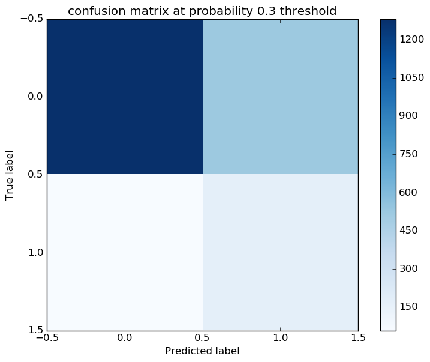
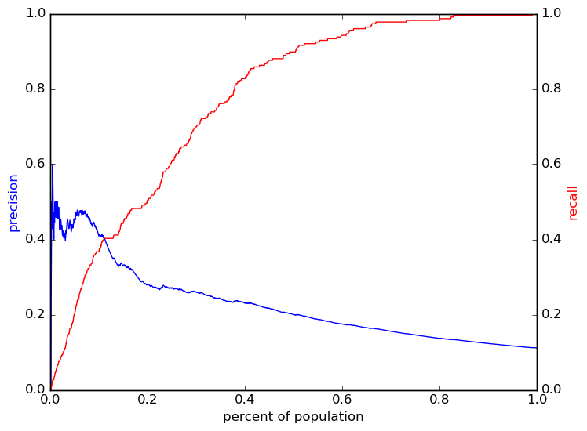
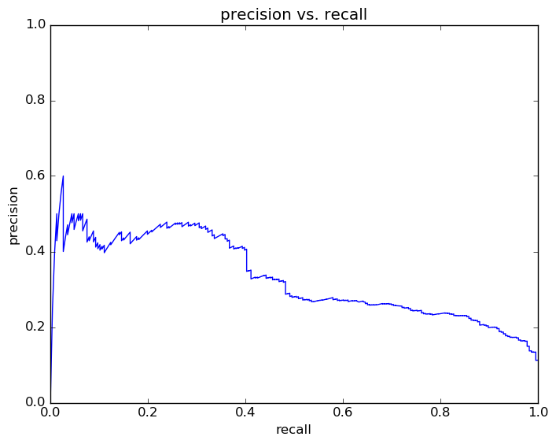
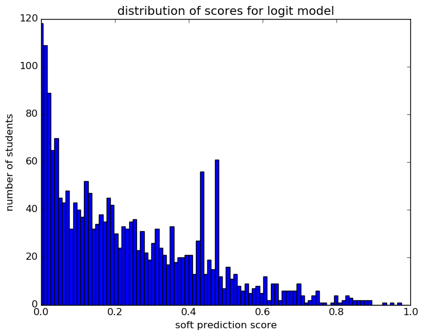

# Report for 08 17 2016 grade 8 param set 16 logit
fourth pass for grade 8

### Model Options
* label used: definite_plus_ogt
* prediction grade: 8
* validation cohorts: 2010
* test cohorts: 2011
	 * 226 positive examples, 1801 negative examples
* train cohorts: 2007, 2008, 2009
	 * 278 postive examples, 2738 negative examples
* parameter choices
	 * penalty = l2
	 * C = 0.1
* cross-validation scores: k fold, with 5 folds
	 * custom_precision_5_15 score: 0.27
	 * custom_recall_5_15 score: 0.3
* imputation strategy: median plus dummies
* scaling strategy: robust

### Features Used
* absence
	 * tardy_wkd_5_gr_7
	 * tardy_wkd_4_gr_7
	 * tardy_unexcused_gr_7
	 * tardy_wkd_1_gr_7
	 * tardy_consec_gr_7
	 * medical_gr_7
	 * absence_wkd_1_gr_7
	 * tardy_gr_7
	 * absence_wkd_2_gr_7
	 * absence_wkd_3_gr_7
	 * absence_consec_gr_7
	 * absence_wkd_4_gr_7
	 * tardy_wkd_2_gr_7
	 * absence_unexcused_gr_7
	 * absence_wkd_5_gr_7
	 * tardy_wkd_3_gr_7
	 * absence_gr_7
* intervention
	 * vocational_gr_7
	 * titlei_gr_7
	 * school_program_gr_7
	 * academic_inv_gr_7
	 * academic_intracurr_gr_7
	 * atheletics_gr_7
	 * placement_gr_7
	 * post_secondary_gr_7
	 * extracurr_program_gr_7
	 * spec_instruc_gr_7
* grades
	 * future_prep_gpa_gr_7
	 * num_future_prep_classes_gr_7
	 * num_humanities_classes_gr_7
	 * gpa_gr_7
	 * num_interventions_classes_gr_7
	 * humanities_gpa_gr_7
	 * num_stem_classes_gr_7
	 * health_gpa_gr_7
	 * interventions_gpa_gr_7
	 * num_pf_classes_gr_7
	 * gpa_district_gr_7
	 * num_health_classes_gr_7
	 * language_gpa_gr_7
	 * num_art_classes_gr_7
	 * num_language_classes_gr_7
	 * stem_gpa_gr_7
	 * percent_passed_pf_classes_gr_7
	 * art_gpa_gr_7
* snapshots
	 * status_gr_7
	 * district_gr_7
	 * limited_english_gr_7
	 * section_504_plan_gr_7
	 * iss_gr_7
	 * gifted_gr_7
	 * disadvantagement_gr_7
	 * special_ed_gr_7
	 * disability_gr_7
	 * discipline_incidents_gr_7
	 * oss_gr_7
* demographics
	 * ethnicity
	 * gender
* oaa_normalized
	 * science_normalized_gr_5
	 * math_normalized_gr_6
	 * read_normalized_gr_7
	 * read_normalized_gr_5
	 * read_normalized_gr_3
	 * socstudies_normalized_gr_5
	 * read_normalized_gr_6
	 * math_normalized_gr_3
	 * read_normalized_gr_4
	 * math_normalized_gr_5
	 * math_normalized_gr_7
	 * math_normalized_gr_4
* mobility
	 * n_cities_to_gr_7
	 * avg_district_change_to_gr_7
	 * n_addresses_to_gr_7
	 * mid_year_withdraw_gr_7
	 * n_districts_to_gr_7
	 * city_transition_in_gr_7
	 * district_transition_in_gr_7
	 * avg_city_change_to_gr_7
	 * avg_address_change_to_gr_7
	 * n_records_to_gr_7
	 * street_transition_in_gr_7

### Performance Metrics
on average, model run in 0.05 seconds (12 times)   metrics on the test set:  precision on top 15%: 0.3289  precision on top 10%: 0.4109  precision on top 5%: 0.4455  recall on top 15%: 0.4425  recall on top 10%: 0.3673  recall on top 5%: 0.1991   metrics on the validation set:  precision on top 15%: 0.3457  precision on top 10%: 0.424  precision on top 5%: 0.5  recall on top 15%: 0.461  recall on top 10%: 0.3759  recall on top 5%: 0.2199  AUC value is: 0.8079  top features: placement_gr_7 (-0.45), gpa_district_gr_7 (-0.44), district_gr_7_Coshocton (0.43)

