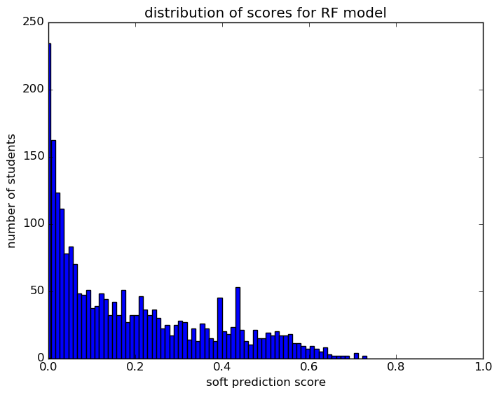
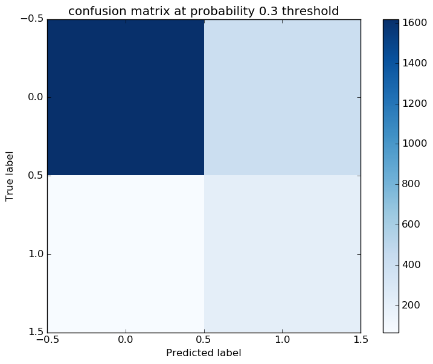
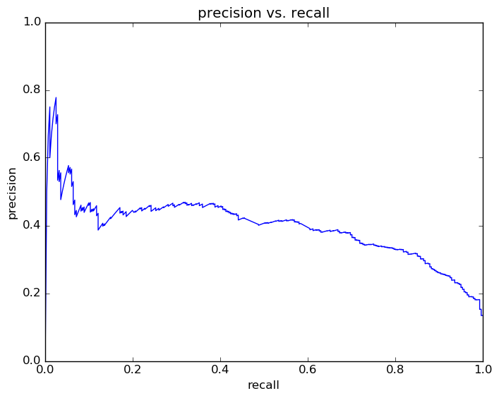
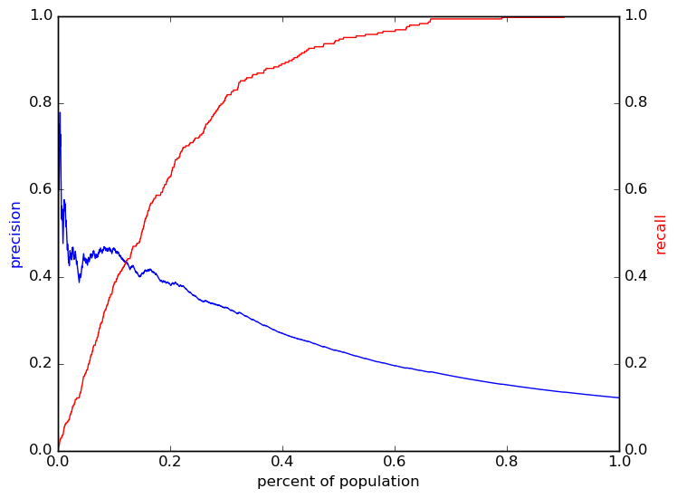

# Report for 08 17 2016 grade 9 param set 22 RF
fourth pass for grade 9

### Model Options
* label used: definite_plus_ogt
* prediction grade: 9
* validation cohorts: 2011
* test cohorts: 2012
	 * 281 positive examples, 2037 negative examples
* train cohorts: 2007, 2008, 2009, 2010
	 * 450 postive examples, 4067 negative examples
* parameter choices
	 * min_samples_split = 3
	 * max_features = sqrt
	 * n_estimators = 1000
	 * max_depth = 20
	 * criterion = entropy
* cross-validation scores: k fold, with 5 folds
	 * custom_precision_5_15 score: 0.31
	 * custom_recall_5_15 score: 0.31
* imputation strategy: median plus dummies
* scaling strategy: robust

### Features Used
* snapshots
	 * district_gr_8
	 * oss_gr_8
	 * gifted_gr_8
	 * discipline_incidents_gr_8
	 * disability_gr_8
	 * iss_gr_8
	 * limited_english_gr_8
	 * special_ed_gr_8
	 * section_504_plan_gr_8
	 * disadvantagement_gr_8
	 * status_gr_8
* demographics
	 * ethnicity
	 * gender
* grades
	 * gpa_gr_8
	 * gpa_district_gr_8
* absence
	 * tardy_gr_8
	 * tardy_unexcused_gr_8
	 * absence_gr_8
	 * absence_unexcused_gr_8
* oaa_normalized
	 * read_normalized_gr_4
	 * read_normalized_gr_5
	 * math_normalized_gr_8
	 * read_normalized_gr_8
	 * read_normalized_gr_3
	 * socstudies_normalized_gr_5
	 * math_normalized_gr_3
	 * math_normalized_gr_7
	 * read_normalized_gr_6
	 * math_normalized_gr_4
	 * science_normalized_gr_8
	 * math_normalized_gr_5
	 * science_normalized_gr_5
	 * math_normalized_gr_6
	 * read_normalized_gr_7

### Performance Metrics
on average, model run in 3.88 seconds (16 times)   metrics on the test set:  precision on top 15%: 0.4063  precision on top 10%: 0.4632  precision on top 5%: 0.4348  recall on top 15%: 0.5018  recall on top 10%: 0.3808  recall on top 5%: 0.1779   metrics on the validation set:  precision on top 15%: 0.3498  precision on top 10%: 0.3535  precision on top 5%: 0.4486  recall on top 15%: 0.4094  recall on top 10%: 0.2754  recall on top 5%: 0.1739  AUC value is: 0.8562  top features: gpa_district_gr_8 (0.085), gpa_gr_8 (0.083), math_normalized_gr_8 (0.065)

