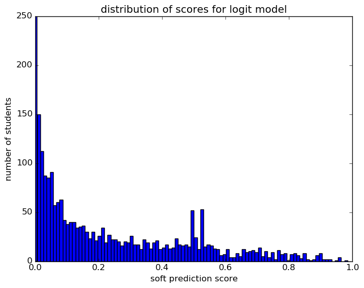
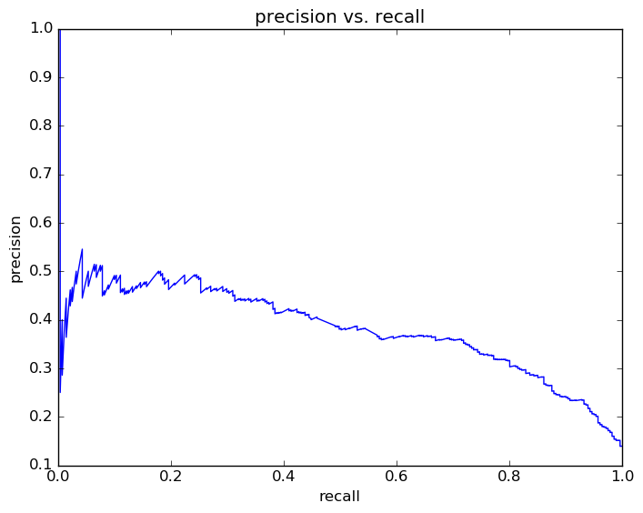
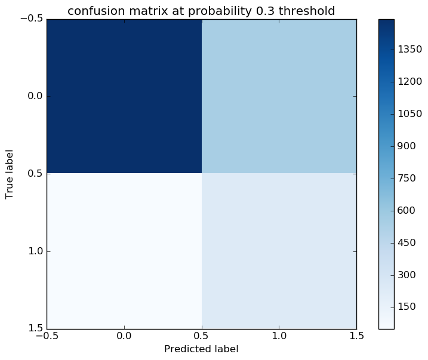
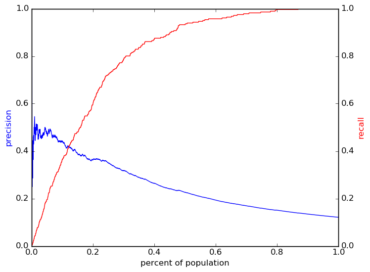

# Report for 08 17 2016 grade 9 param set 22 logit
fourth pass for grade 9

### Model Options
* label used: definite_plus_ogt
* prediction grade: 9
* validation cohorts: 2011
* test cohorts: 2012
	 * 281 positive examples, 2037 negative examples
* train cohorts: 2007, 2008, 2009, 2010
	 * 450 postive examples, 4067 negative examples
* parameter choices
	 * penalty = l1
	 * C = 1.0
* cross-validation scores: k fold, with 5 folds
	 * custom_precision_5_15 score: 0.3
	 * custom_recall_5_15 score: 0.32
* imputation strategy: median plus dummies
* scaling strategy: robust

### Features Used
* absence
	 * absence_unexcused_gr_8
	 * tardy_gr_8
	 * absence_gr_8
	 * tardy_unexcused_gr_8
* demographics
	 * gender
	 * ethnicity
* oaa_normalized
	 * science_normalized_gr_5
	 * math_normalized_gr_7
	 * math_normalized_gr_5
	 * math_normalized_gr_8
	 * read_normalized_gr_6
	 * socstudies_normalized_gr_5
	 * read_normalized_gr_4
	 * science_normalized_gr_8
	 * math_normalized_gr_4
	 * read_normalized_gr_5
	 * read_normalized_gr_3
	 * math_normalized_gr_3
	 * math_normalized_gr_6
	 * read_normalized_gr_7
	 * read_normalized_gr_8
* snapshots
	 * iss_gr_8
	 * district_gr_8
	 * disadvantagement_gr_8
	 * status_gr_8
	 * section_504_plan_gr_8
	 * oss_gr_8
	 * special_ed_gr_8
	 * discipline_incidents_gr_8
	 * limited_english_gr_8
	 * gifted_gr_8
	 * disability_gr_8
* grades
	 * gpa_gr_8
	 * gpa_district_gr_8

### Performance Metrics
on average, model run in 0.11 seconds (12 times)   metrics on the test set:  precision on top 15%: 0.389  precision on top 10%: 0.4416  precision on top 5%: 0.4783  recall on top 15%: 0.4804  recall on top 10%: 0.363  recall on top 5%: 0.1957   metrics on the validation set:  precision on top 15%: 0.3437  precision on top 10%: 0.3953  precision on top 5%: 0.4579  recall on top 15%: 0.4022  recall on top 10%: 0.308  recall on top 5%: 0.1775  AUC value is: 0.8432  top features: ethnicity_nan (3.3), special_ed_gr_8_100 (-0.92), read_normalized_gr_8_isnull (0.87)

