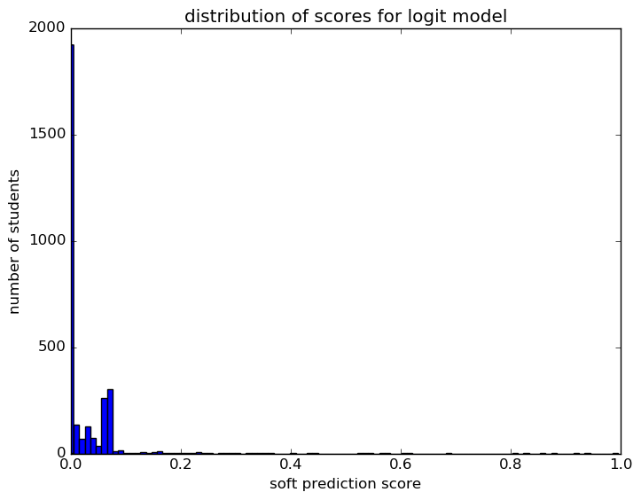
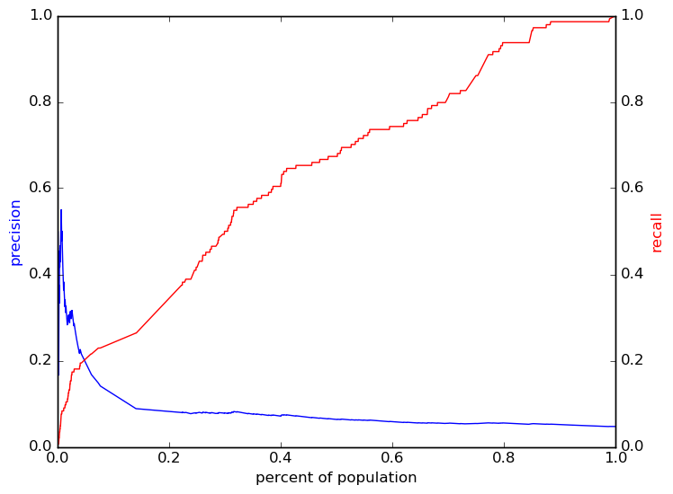

# Report for 2 years data 4 cohorts jackie logit
testing grid search cross validation multiple criterion

### Model Options
* label used: definite
* initial cohort grade: 0
* test cohorts: 2011, 2012
	 * 144 positive examples, 2907 negative examples
* train cohorts: 2007, 2008, 2009, 2010
	 * 97 postive examples, 3883 negative examples
* cross-validation scheme: leave cohort out
	 * searching C in 0.01, 0.1, 1.0, 10.0, 100, 1000
	 * chose C = 1000
	 * searching penalty in l1, l2
	 * chose penalty = l2
	 * using ['custom_precision_10', 'average_precision', 'custom_recall_10']
* imputation strategy: median plus dummies
* scaling strategy: robust

### Features Used
* demographics
	 * gender
	 * ethnicity
* mobility
	 * district_transition_in_gr_8
	 * n_addresses_to_gr_8
	 * n_cities_to_gr_8
	 * district_transition_in_gr_9
	 * city_transition_in_gr_9
	 * n_districts_to_gr_9
	 * avg_district_change_to_gr_8
	 * avg_address_change_to_gr_9
	 * n_districts_to_gr_8
	 * n_records_to_gr_9
	 * mid_year_withdraw_gr_8
	 * street_transition_in_gr_9
	 * city_transition_in_gr_8
	 * avg_address_change_to_gr_8
	 * avg_city_change_to_gr_8
	 * avg_district_change_to_gr_9
	 * n_records_to_gr_8
	 * n_cities_to_gr_9
	 * street_transition_in_gr_8
	 * avg_city_change_to_gr_9
	 * mid_year_withdraw_gr_9
	 * n_addresses_to_gr_9
* grades
	 * num_future_prep_classes_gr_8
	 * num_stem_classes_gr_8
	 * humanities_gpa_gr_8
	 * percent_passed_pf_classes_gr_8
	 * stem_gpa_gr_8
	 * num_health_classes_gr_9
	 * health_gpa_gr_9
	 * num_language_classes_gr_8
	 * num_health_classes_gr_8
	 * num_art_classes_gr_8
	 * interventions_gpa_gr_8
	 * percent_passed_pf_classes_gr_9
	 * health_gpa_gr_8
	 * language_gpa_gr_9
	 * stem_gpa_gr_9
	 * num_humanities_classes_gr_8
	 * art_gpa_gr_8
	 * gpa_district_gr_8
	 * art_gpa_gr_9
	 * num_stem_classes_gr_9
	 * num_future_prep_classes_gr_9
	 * num_interventions_classes_gr_9
	 * num_humanities_classes_gr_9
	 * num_art_classes_gr_9
	 * language_gpa_gr_8
	 * num_pf_classes_gr_8
	 * num_pf_classes_gr_9
	 * gpa_district_gr_9
	 * num_interventions_classes_gr_8
	 * future_prep_gpa_gr_9
	 * future_prep_gpa_gr_8
	 * humanities_gpa_gr_9
	 * num_language_classes_gr_9
	 * interventions_gpa_gr_9

### Performance Metrics
on average, model run in 0.21 seconds (12 times)  precision on top 15%: 0.07965  precision on top 10%: 0.08879  precision on top 5%: 0.1703  recall on top 15%: 0.375  recall on top 10%: 0.2639  recall on top 5%: 0.2153  AUC value is: 0.6472  top features: n_addresses_to_gr_8 (-1.3e+01), humanities_gpa_gr_8_isnull (1.1e+01), n_districts_to_gr_8 (1.1e+01)

