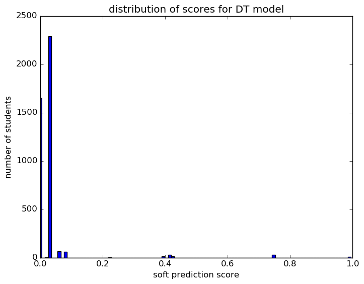
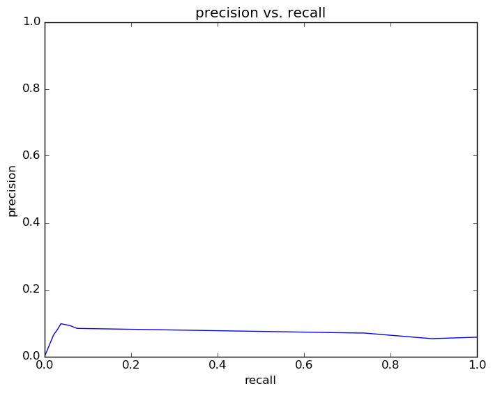
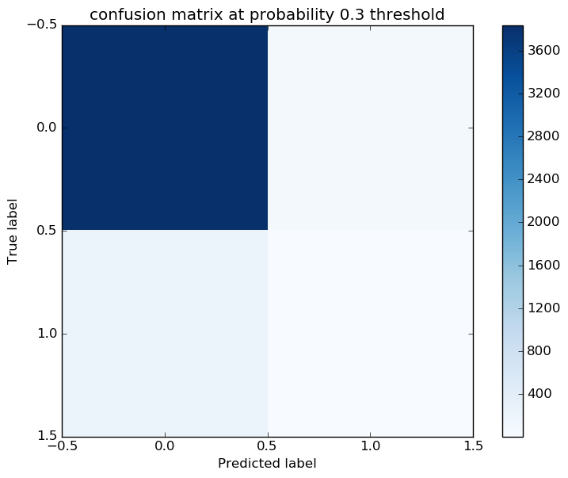

# Report for 3 years data 2 cohorts DT
testing yaml creation

### Model Options
* label used: definite
* initial cohort grade: 9
* test cohorts: 2011, 2012
	 * 239 positive examples, 3918 negative examples
* train cohorts: 2009, 2010
	 * 65 postive examples, 2062 negative examples
* cross-validation scheme: leave cohort out
	 * searching criterion in entropy
	 * chose criterion = entropy
	 * searching max_depth in 5
	 * chose max_depth = 5
	 * using custom_precision_10
* imputation strategy: median plus dummies
* scaling strategy: robust

### Features Used
* grades
	 * num_interventions_classes_gr_6
	 * num_art_classes_gr_7
	 * health_gpa_gr_7
	 * language_gpa_gr_7
	 * stem_gpa_gr_6
	 * num_interventions_classes_gr_7
	 * health_gpa_gr_8
	 * language_gpa_gr_6
	 * art_gpa_gr_6
	 * percent_passed_pf_classes_gr_6
	 * humanities_gpa_gr_6
	 * num_health_classes_gr_6
	 * interventions_gpa_gr_7
	 * humanities_gpa_gr_7
	 * num_art_classes_gr_8
	 * stem_gpa_gr_7
	 * num_humanities_classes_gr_8
	 * num_health_classes_gr_7
	 * num_pf_classes_gr_6
	 * num_interventions_classes_gr_8
	 * interventions_gpa_gr_6
	 * language_gpa_gr_8
	 * future_prep_gpa_gr_7
	 * num_stem_classes_gr_7
	 * future_prep_gpa_gr_6
	 * num_humanities_classes_gr_6
	 * num_humanities_classes_gr_7
	 * percent_passed_pf_classes_gr_7
	 * num_future_prep_classes_gr_6
	 * stem_gpa_gr_8
	 * num_language_classes_gr_7
	 * gpa_district_gr_6
	 * humanities_gpa_gr_8
	 * num_pf_classes_gr_7
	 * art_gpa_gr_8
	 * interventions_gpa_gr_8
	 * art_gpa_gr_7
	 * num_future_prep_classes_gr_7
	 * num_health_classes_gr_8
	 * percent_passed_pf_classes_gr_8
	 * num_stem_classes_gr_6
	 * num_language_classes_gr_6
	 * gpa_district_gr_7
	 * future_prep_gpa_gr_8
	 * num_stem_classes_gr_8
	 * health_gpa_gr_6
	 * num_future_prep_classes_gr_8
	 * num_art_classes_gr_6
	 * gpa_district_gr_8
	 * num_pf_classes_gr_8
	 * num_language_classes_gr_8
* mobility
	 * avg_address_change_to_gr_7
	 * n_records_to_gr_8
	 * n_records_to_gr_7
	 * district_transition_in_gr_6
	 * n_addresses_to_gr_6
	 * avg_city_change_to_gr_8
	 * mid_year_withdraw_gr_8
	 * avg_district_change_to_gr_8
	 * n_records_to_gr_6
	 * city_transition_in_gr_6
	 * n_cities_to_gr_8
	 * avg_district_change_to_gr_7
	 * city_transition_in_gr_7
	 * district_transition_in_gr_8
	 * n_districts_to_gr_6
	 * city_transition_in_gr_8
	 * n_cities_to_gr_6
	 * avg_district_change_to_gr_6
	 * mid_year_withdraw_gr_6
	 * street_transition_in_gr_8
	 * district_transition_in_gr_7
	 * n_addresses_to_gr_8
	 * n_districts_to_gr_7
	 * mid_year_withdraw_gr_7
	 * avg_address_change_to_gr_6
	 * avg_city_change_to_gr_7
	 * avg_address_change_to_gr_8
	 * avg_city_change_to_gr_6
	 * street_transition_in_gr_6
	 * street_transition_in_gr_7
	 * n_addresses_to_gr_7
	 * n_cities_to_gr_7
	 * n_districts_to_gr_8
* demographics
	 * ethnicity
	 * gender

### Performance Metrics
on average, model run in 0.11 seconds (1 times)  precision on top 15%: 0.06986  precision on top 10%: 0.06986  precision on top 5%: 0.08372  recall on top 15%: 0.7322  recall on top 10%: 0.7322  recall on top 5%: 0.07531  AUC value is: 0.5556  top features: stem_gpa_gr_7 (0.21), humanities_gpa_gr_7_isnull (0.12), gpa_district_gr_8 (0.095)

