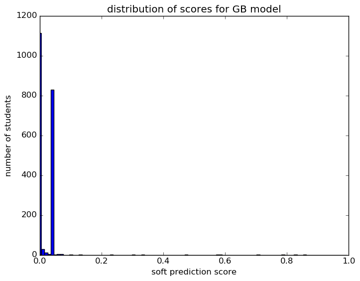
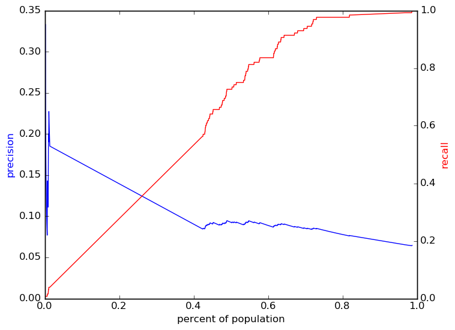
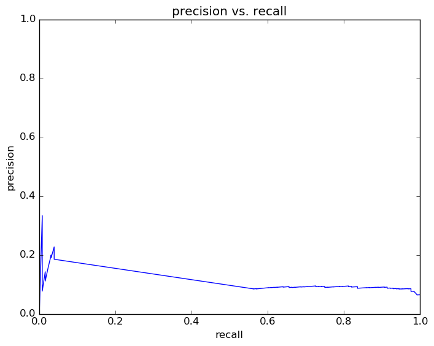
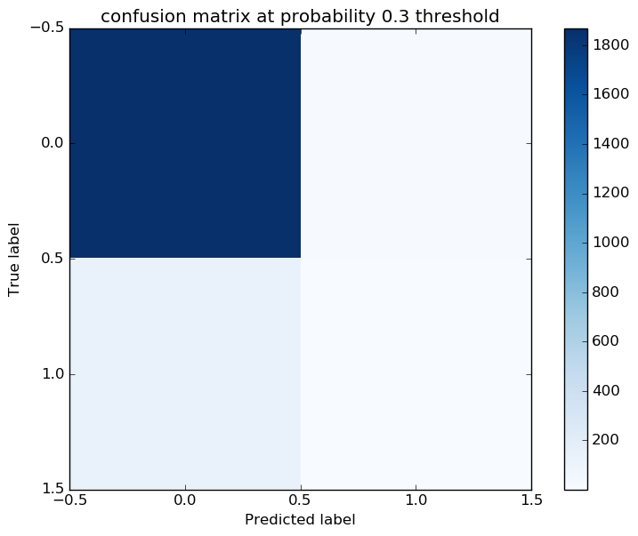

# Report for GB topFeatures GB
test GB top features

### Model Options
* label used: definite
* initial cohort grade: 9
* test cohorts: 2011
	 * 128 positive examples, 1881 negative examples
* train cohorts: 2008, 2009, 2010
	 * 96 postive examples, 3046 negative examples
* cross-validation scheme: leave cohort out
	 * searching learning_rate in 0.01
	 * chose learning_rate = 0.01
	 * searching subsample in 0.5
	 * chose subsample = 0.5
	 * searching n_estimators in 500
	 * chose n_estimators = 500
	 * searching max_depth in 30
	 * chose max_depth = 30
	 * using custom_precision_10
* imputation strategy: median plus dummies
* scaling strategy: robust

### Features Used
* snapshots
	 * disability_gr_8
	 * days_absent_unexcused_gr_8
	 * disability_gr_7
	 * district_gr_7
	 * days_absent_gr_7
	 * iss_gr_8
	 * iss_gr_7
	 * discipline_incidents_gr_7
	 * special_ed_gr_7
	 * gifted_gr_8
	 * limited_english_gr_7
	 * district_gr_8
	 * days_absent_gr_8
	 * disadvantagement_gr_7
	 * special_ed_gr_8
	 * disadvantagement_gr_8
	 * discipline_incidents_gr_8
	 * days_absent_unexcused_gr_7
	 * gifted_gr_7
	 * limited_english_gr_8
	 * oss_gr_7
	 * oss_gr_8

### Performance Metrics
on average, model run in 122.84 seconds (1 times)  precision on top 15%: 0.08471  precision on top 10%: 0.08471  precision on top 5%: 0.08471  recall on top 15%: 0.5625  recall on top 10%: 0.5625  recall on top 5%: 0.5625  AUC value is: 0.6468  top features: days_absent_gr_8 (0.22), days_absent_gr_7 (0.17), discipline_incidents_gr_8 (0.064)

