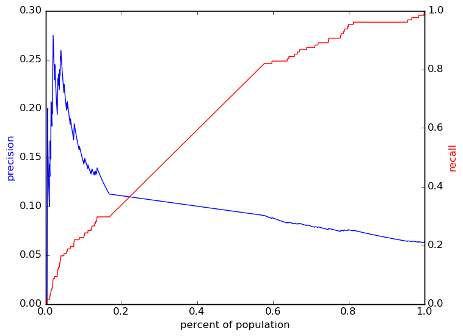
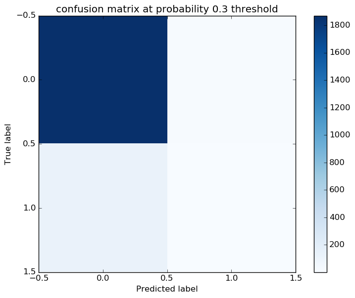
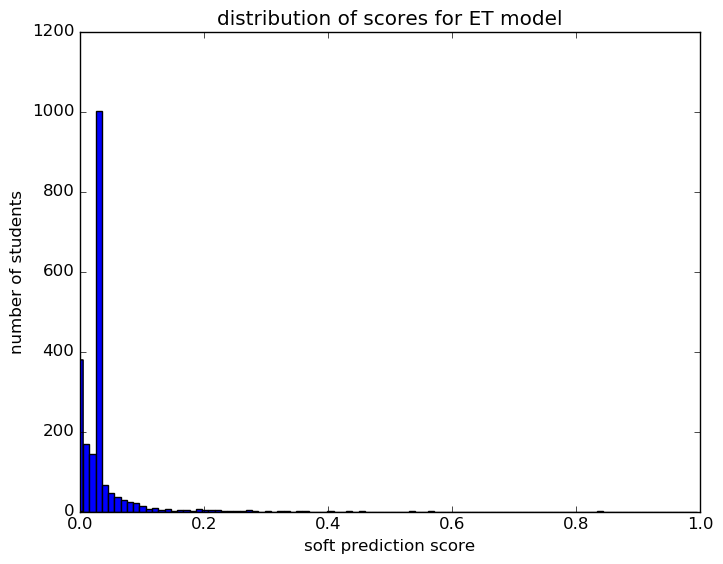
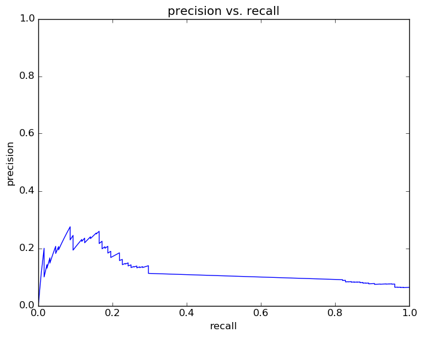

# Report for RF topFeatures ET
test RF top features

### Model Options
* label used: definite
* initial cohort grade: 9
* test cohorts: 2011
	 * 128 positive examples, 1881 negative examples
* train cohorts: 2008, 2009, 2010
	 * 96 postive examples, 3046 negative examples
* cross-validation scheme: leave cohort out
	 * searching max_depth in 20
	 * chose max_depth = 20
	 * searching n_estimators in 500
	 * chose n_estimators = 500
	 * searching criterion in gini, entropy
	 * chose criterion = gini
	 * searching max_features in sqrt
	 * chose max_features = sqrt
	 * searching min_samples_split in 2, 5
	 * chose min_samples_split = 2
	 * using custom_precision_10
* imputation strategy: median plus dummies
* scaling strategy: robust

### Features Used
* snapshots
	 * disability_gr_7
	 * disadvantagement_gr_7
	 * disability_gr_8
	 * district_gr_7
	 * days_absent_unexcused_gr_7
	 * limited_english_gr_7
	 * district_gr_8
	 * days_absent_unexcused_gr_8
	 * gifted_gr_7
	 * iss_gr_8
	 * special_ed_gr_7
	 * disadvantagement_gr_8
	 * discipline_incidents_gr_8
	 * gifted_gr_8
	 * days_absent_gr_8
	 * oss_gr_8
	 * limited_english_gr_8
	 * iss_gr_7
	 * days_absent_gr_7
	 * oss_gr_7
	 * discipline_incidents_gr_7
	 * special_ed_gr_8

### Performance Metrics
on average, model run in 7.70 seconds (4 times)  precision on top 15%: 0.1258  precision on top 10%: 0.1443  precision on top 5%: 0.2178  recall on top 15%: 0.2969  recall on top 10%: 0.2266  recall on top 5%: 0.1719  AUC value is: 0.6581  top features: days_absent_gr_8 (0.13), days_absent_gr_7 (0.12), discipline_incidents_gr_8 (0.092)

