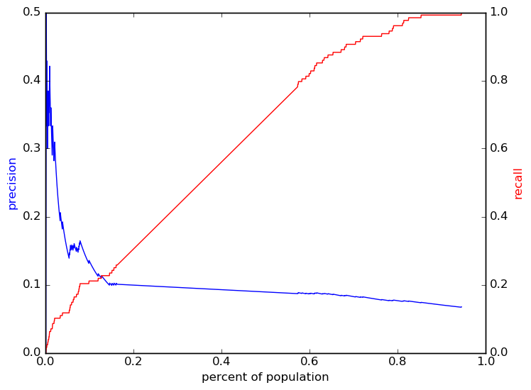
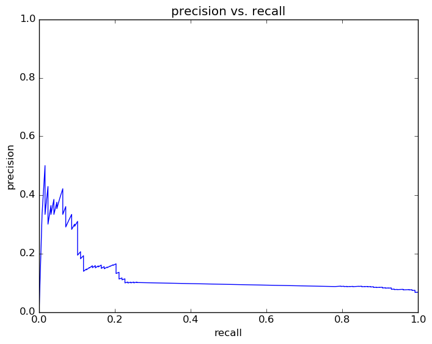
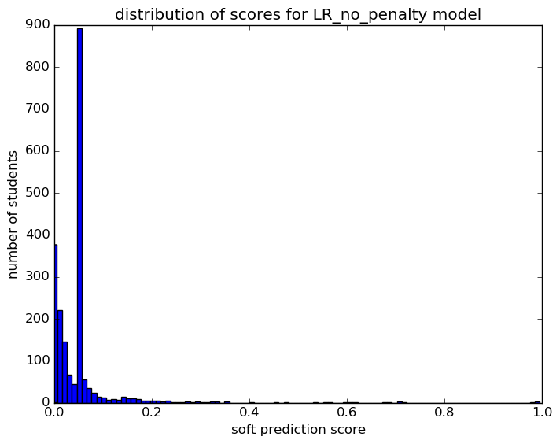
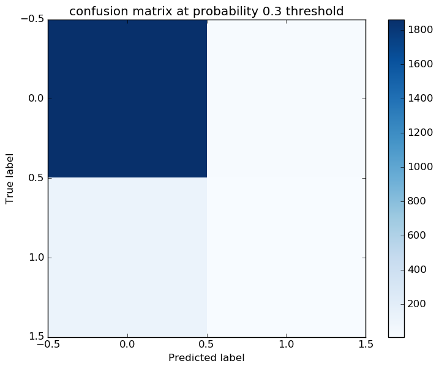

# Report for RF topFeatures LR_no_penalty
test RF top features

### Model Options
* label used: definite
* initial cohort grade: 9
* test cohorts: 2011
	 * 128 positive examples, 1881 negative examples
* train cohorts: 2008, 2009, 2010
	 * 96 postive examples, 3046 negative examples
* cross-validation scheme: leave cohort out
	 * using custom_precision_10
* imputation strategy: median plus dummies
* scaling strategy: robust

### Features Used
* snapshots
	 * iss_gr_8
	 * special_ed_gr_8
	 * days_absent_unexcused_gr_8
	 * gifted_gr_8
	 * iss_gr_7
	 * limited_english_gr_7
	 * district_gr_7
	 * limited_english_gr_8
	 * days_absent_gr_8
	 * discipline_incidents_gr_8
	 * special_ed_gr_7
	 * discipline_incidents_gr_7
	 * days_absent_gr_7
	 * disadvantagement_gr_8
	 * gifted_gr_7
	 * district_gr_8
	 * oss_gr_8
	 * oss_gr_7
	 * disadvantagement_gr_7
	 * disability_gr_8
	 * days_absent_unexcused_gr_7
	 * disability_gr_7

### Performance Metrics
on average, model run in 0.36 seconds (1 times)  precision on top 15%: 0.09901  precision on top 10%: 0.1343  precision on top 5%: 0.1485  recall on top 15%: 0.2344  recall on top 10%: 0.2109  recall on top 5%: 0.1172  AUC value is: 0.65  top features: disability_gr_7_other major (1.8e+01), disability_gr_7_visual impairment (1.3e+01), disability_gr_8_speech and language impairment (1.1e+01)

