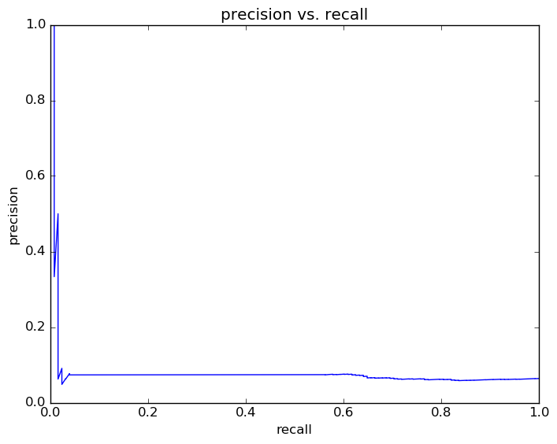
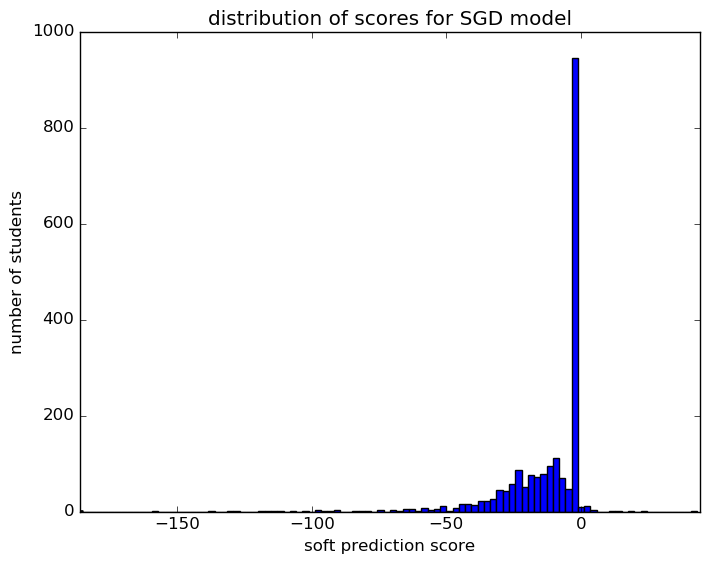
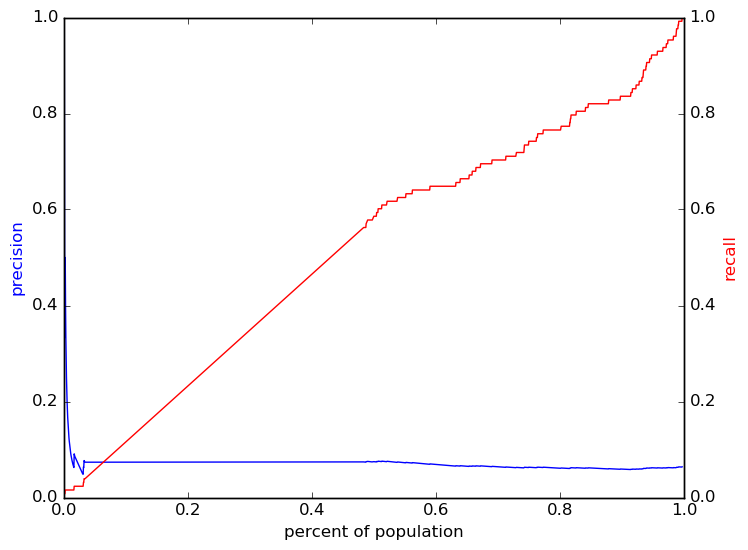
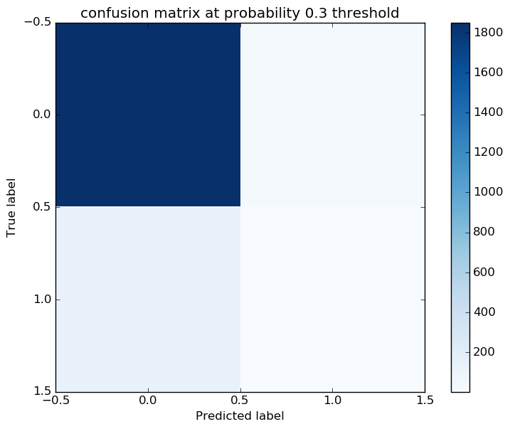

# Report for RF topFeatures SGD
test RF top features

### Model Options
* label used: definite
* initial cohort grade: 9
* test cohorts: 2011
	 * 128 positive examples, 1881 negative examples
* train cohorts: 2008, 2009, 2010
	 * 96 postive examples, 3046 negative examples
* cross-validation scheme: leave cohort out
	 * searching loss in hinge, log, perceptron
	 * chose loss = perceptron
	 * searching penalty in l2, l1, elasticnet
	 * chose penalty = elasticnet
	 * using custom_precision_10
* imputation strategy: median plus dummies
* scaling strategy: robust

### Features Used
* snapshots
	 * iss_gr_8
	 * oss_gr_7
	 * district_gr_7
	 * discipline_incidents_gr_8
	 * oss_gr_8
	 * disadvantagement_gr_7
	 * disability_gr_8
	 * discipline_incidents_gr_7
	 * special_ed_gr_8
	 * days_absent_unexcused_gr_7
	 * limited_english_gr_8
	 * special_ed_gr_7
	 * gifted_gr_8
	 * iss_gr_7
	 * days_absent_unexcused_gr_8
	 * gifted_gr_7
	 * days_absent_gr_8
	 * limited_english_gr_7
	 * district_gr_8
	 * days_absent_gr_7
	 * disability_gr_7
	 * disadvantagement_gr_8

### Performance Metrics
on average, model run in 0.06 seconds (9 times)  precision on top 15%: 0.07415  precision on top 10%: 0.07415  precision on top 5%: 0.07415  recall on top 15%: 0.5625  recall on top 10%: 0.5625  recall on top 5%: 0.5625  AUC value is: 0.5222  top features: discipline_incidents_gr_8 (4.5), disability_gr_8_cognitive disability (2.9), iss_gr_8 (2.9)

