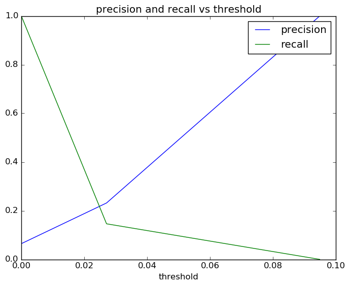
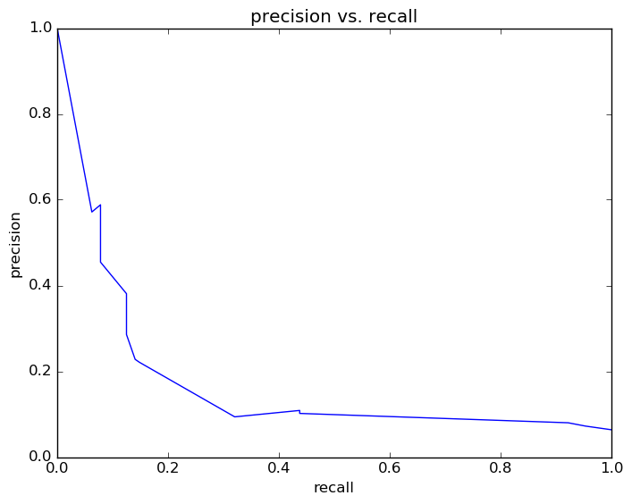
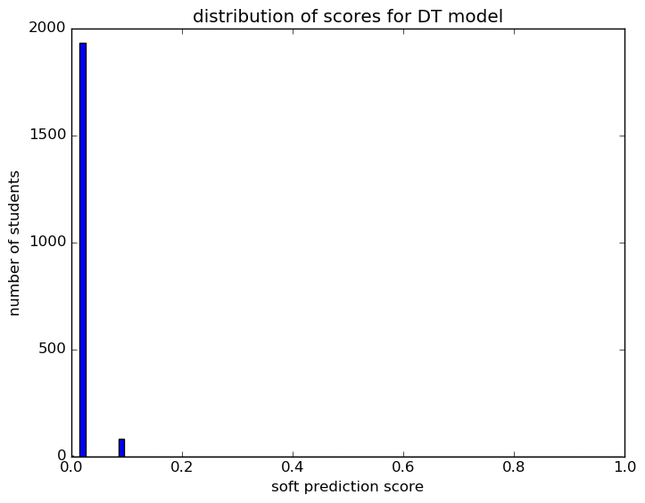
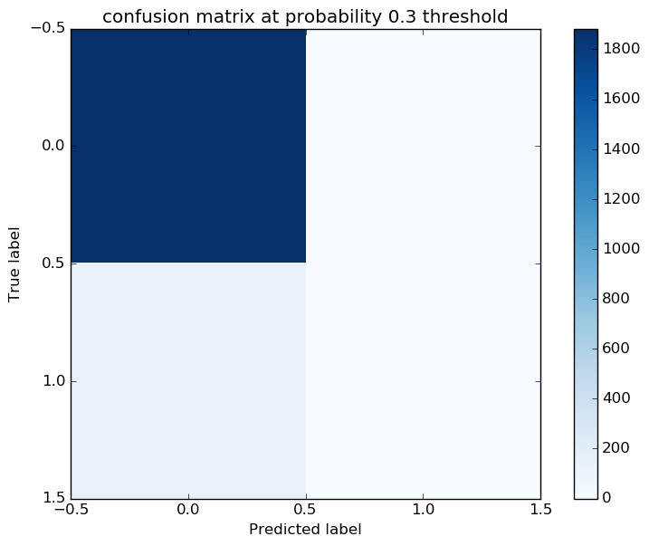

# Report for auto expand features test DT
expand features and grade range

### Model Options
* label used: definite
* initial cohort grade: 9
* test cohorts: 2011
	 * 130 positive examples, 1883 negative examples
* train cohorts: 2009, 2010
	 * 67 postive examples, 2063 negative examples
* cross-validation scheme: leave cohort out
	 * searching max_depth in 1, 5, 10, 20, 50, 100
	 * chose max_depth = 1
	 * searching max_features in sqrt, log2
	 * chose max_features = sqrt
	 * searching criterion in gini, entropy
	 * chose criterion = gini
	 * searching min_samples_split in 2, 5, 10
	 * chose min_samples_split = 2
	 * using custom_recall_10
* imputation strategy: median plus dummies
* scaling strategy: robust

### Features Used
* demographics
	 * gender
	 * ethnicity
* mobility
	 * n_cities_to_gr_8
	 * n_cities_to_gr_9
	 * n_addresses_to_gr_7
	 * n_addresses_to_gr_9
	 * n_districts_to_gr_9
	 * n_addresses_to_gr_8
	 * n_districts_to_gr_7
	 * n_districts_to_gr_8
	 * n_districts_to_gr_6
	 * n_cities_to_gr_7
	 * n_addresses_to_gr_6
	 * n_cities_to_gr_6
* snapshots
	 * status_gr_9
	 * days_absent_unexcused_gr_6
	 * status_gr_6
	 * days_absent_gr_7
	 * disadvantagement_gr_9
	 * iss_gr_7
	 * oss_gr_6
	 * limited_english_gr_9
	 * status_gr_8
	 * special_ed_gr_8
	 * days_absent_unexcused_gr_9
	 * iss_gr_9
	 * days_absent_unexcused_gr_8
	 * special_ed_gr_7
	 * district_gr_8
	 * days_absent_gr_6
	 * iss_gr_6
	 * discipline_incidents_gr_8
	 * disadvantagement_gr_7
	 * disadvantagement_gr_6
	 * days_absent_gr_9
	 * discipline_incidents_gr_9
	 * district_gr_7
	 * discipline_incidents_gr_6
	 * special_ed_gr_6
	 * disability_gr_6
	 * gifted_gr_7
	 * limited_english_gr_7
	 * gifted_gr_9
	 * disadvantagement_gr_8
	 * disability_gr_7
	 * oss_gr_8
	 * district_gr_6
	 * gifted_gr_6
	 * gifted_gr_8
	 * days_absent_gr_8
	 * status_gr_7
	 * disability_gr_9
	 * disability_gr_8
	 * iss_gr_8
	 * district_gr_9
	 * oss_gr_7
	 * oss_gr_9
	 * special_ed_gr_9
	 * days_absent_unexcused_gr_7
	 * limited_english_gr_8
	 * limited_english_gr_6
	 * discipline_incidents_gr_7
* grades
	 * gpa_gr_7
	 * gpa_gr_9
	 * gpa_gr_6
	 * gpa_gr_8

### Performance Metrics

