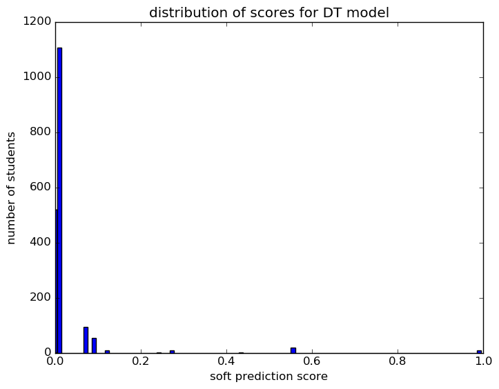

# Report for auto expand features test xc DT
expand features and grade range

### Model Options
* label used: definite
* initial cohort grade: 9
* test cohorts: 2011
	 * 107 positive examples, 1713 negative examples
* train cohorts: 2007, 2008, 2009, 2010
	 * 126 postive examples, 4067 negative examples
* cross-validation scheme: leave cohort out
	 * searching criterion in entropy
	 * chose criterion = entropy
	 * searching max_depth in 5
	 * chose max_depth = 5
	 * using custom_recall_10
* imputation strategy: median plus dummies
* scaling strategy: robust

### Features Used
* absence
	 * tardy_unexcused_gr_9
	 * absence_consec_gr_9
	 * tardy_consec_gr_9
	 * medical_gr_9
	 * tardy_gr_9
* snapshots
	 * discipline_incidents_gr_9
	 * district_gr_9
	 * disability_gr_9
	 * status_gr_9
	 * oss_gr_9
	 * gifted_gr_9
	 * iss_gr_9
	 * days_absent_gr_9
	 * special_ed_gr_9
	 * days_absent_unexcused_gr_9
	 * limited_english_gr_9
	 * disadvantagement_gr_9
* mobility
	 * n_addresses_to_gr_9
	 * n_cities_to_gr_9
	 * n_districts_to_gr_9
* grades
	 * gpa_gr_9

### Performance Metrics
on average, model run in 0.13 seconds (1 times)  precision on top 15%: 0.073  precision on top 10%: 0.2  precision on top 5%: 0.275  recall on top 15%: 0.888  recall on top 10%: 0.364  recall on top 5%: 0.262  AUC value is: 0.678  top features: gpa_gr_9 (0.46), days_absent_gr_9 (0.17), discipline_incidents_gr_9 (0.072)

