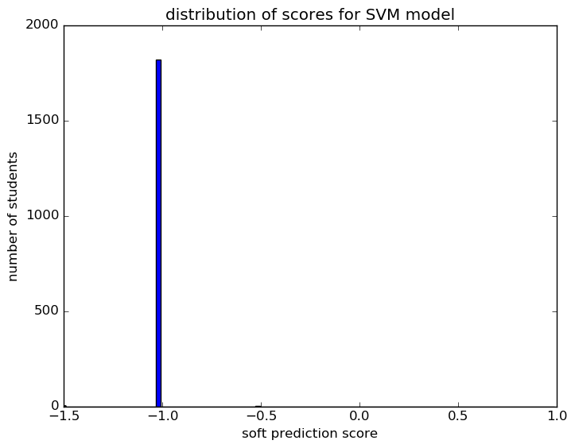
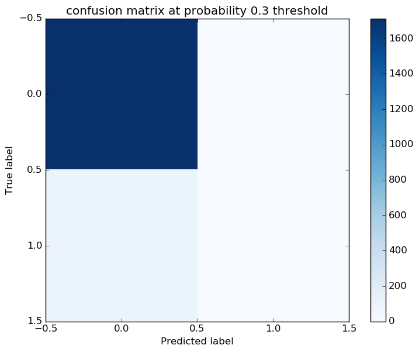
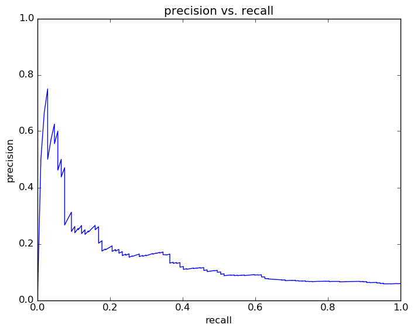
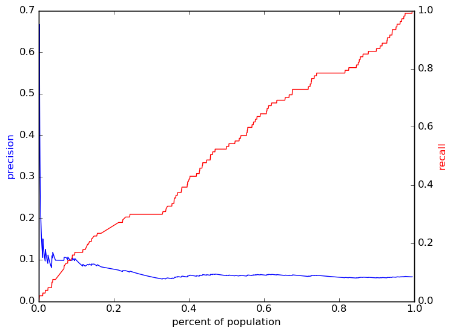

# Report for auto expand features test xc SVM
expand features and grade range

### Model Options
* label used: definite
* initial cohort grade: 9
* test cohorts: 2011
	 * 107 positive examples, 1713 negative examples
* train cohorts: 2009, 2010
	 * 66 postive examples, 2062 negative examples
* cross-validation scheme: leave cohort out
	 * searching kernel in linear
	 * chose kernel = linear
	 * searching C in 1.0
	 * chose C = 1.0
	 * using custom_recall_10
* imputation strategy: median plus dummies
* scaling strategy: robust

### Features Used
* mobility
	 * n_cities_to_gr_9
	 * n_addresses_to_gr_9
	 * n_districts_to_gr_9
* snapshots
	 * disadvantagement_gr_9
	 * days_absent_unexcused_gr_9
	 * gifted_gr_9
	 * status_gr_9
	 * disability_gr_9
	 * district_gr_9
	 * special_ed_gr_9
	 * oss_gr_9
	 * limited_english_gr_9
	 * days_absent_gr_9
	 * discipline_incidents_gr_9
	 * iss_gr_9
* grades
	 * gpa_gr_9

### Performance Metrics
on average, model run in 1.21 seconds (1 times)  precision on top 10%: 0.164  precision on top 5%: 0.207  top features: status_gr_9_mrdd (1.0), disability_gr_9_other major (0.5), status_gr_9_esc (0.002)

