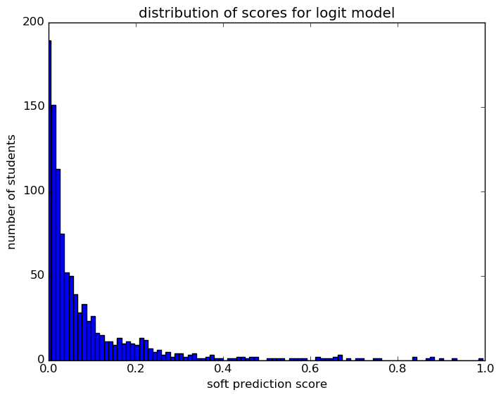
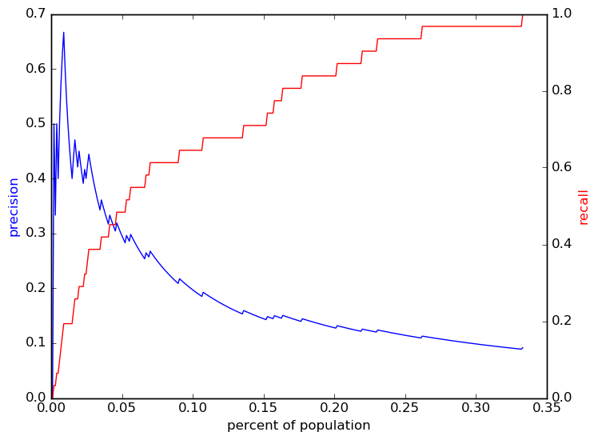
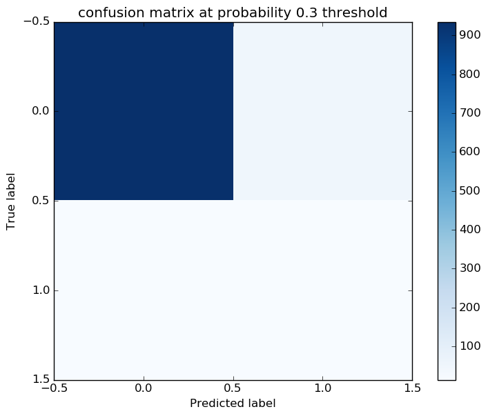

# Report for deep dive 1 year logit
initial results to use in the deep dive 6/26, only using 9th grade data

### Model Options
* label used: definite
* initial cohort grade: 9
* test cohorts: 2008
	 * 32 positive examples, 998 negative examples
* train cohorts: 2006, 2007
	 * 53 postive examples, 1984 negative examples
* cross-validation scheme: leave cohort out
	 * searching C in 1.0
	 * chose C = 1.0
	 * searching penalty in l1
	 * chose penalty = l1
	 * using custom_precision_10
* imputation strategy: median plus dummies
* scaling strategy: robust

### Features Used
* grades
	 * gpa_gr_9
* snapshots
	 * disadvantagement_gr_9
	 * disability_gr_9
	 * district_gr_9
	 * gifted_gr_9
	 * iss_gr_9
	 * oss_gr_9
	 * limited_english_gr_9
	 * special_ed_gr_9
	 * status_gr_9
	 * days_absent_gr_9
	 * days_absent_unexcused_gr_9
	 * discipline_incidents_gr_9
* demographics
	 * ethnicity
	 * gender
* mobility
	 * n_addresses_to_gr_9
	 * n_cities_to_gr_9
	 * n_districts_to_gr_9

### Performance Metrics
on average, model run in 0.06 seconds (1 times)  precision on top 10%: 0.221  precision on top 5%: 0.269  top features: disability_gr_9_multiple (2.2), gpa_gr_9_isnull (1.8), disability_gr_9_emotional disturbance (1.4)

