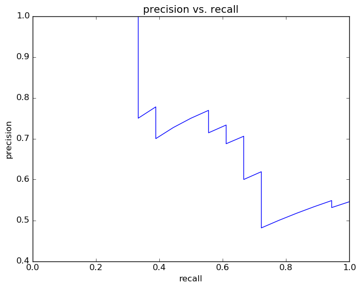
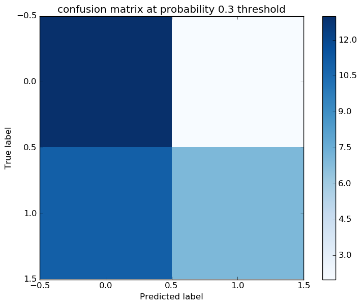
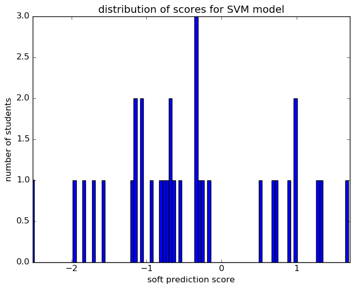

# Report for param set 0 SVM
testing all options by looping throughwith a just 100 students

### Model Options
* label used: not_on_time
* initial cohort grade: 9
* test cohorts: 2011, 2012
	 * 18 positive examples, 15 negative examples
* train cohorts: 2009, 2010
	 * 11 postive examples, 12 negative examples
* cross-validation scheme: leave cohort out
	 * searching C in 1.0
	 * chose C = 1.0
	 * searching kernel in linear
	 * chose kernel = linear
	 * using ['custom_precision_5', 'f1']
* imputation strategy: median plus dummies
* scaling strategy: robust

### Features Used
* demographics
	 * gender
	 * ethnicity
* snapshots
	 * section_504_plan_gr_6
	 * status_gr_6
	 * limited_english_gr_6
	 * days_absent_excused_gr_7
	 * days_present_gr_7
	 * status_gr_7
	 * days_absent_unexcused_gr_6
	 * days_absent_unexcused_gr_8
	 * limited_english_gr_8
	 * oss_gr_6
	 * gifted_gr_6
	 * oss_gr_8
	 * section_504_plan_gr_8
	 * special_ed_gr_6
	 * gifted_gr_7
	 * days_absent_excused_gr_6
	 * iss_gr_6
	 * district_gr_8
	 * district_gr_7
	 * days_present_gr_8
	 * limited_english_gr_7
	 * district_gr_6
	 * disadvantagement_gr_7
	 * gifted_gr_8
	 * disadvantagement_gr_8
	 * discipline_incidents_gr_6
	 * disability_gr_7
	 * iss_gr_8
	 * disability_gr_8
	 * days_absent_gr_6
	 * disadvantagement_gr_6
	 * special_ed_gr_7
	 * discipline_incidents_gr_8
	 * status_gr_8
	 * days_absent_unexcused_gr_7
	 * section_504_plan_gr_7
	 * special_ed_gr_8
	 * discipline_incidents_gr_7
	 * disability_gr_6
	 * days_absent_gr_8
	 * days_absent_gr_7
	 * days_present_gr_6
	 * days_absent_excused_gr_8
	 * oss_gr_7
	 * iss_gr_7
* grades
	 * gpa_gr_7
	 * gpa_gr_8
	 * gpa_gr_6
* oaa_normalized
	 * third_math_percentile
	 * sixth_math_pl
	 * fifth_math_pl
	 * fourth_read_normalized
	 * eighth_math_pl
	 * sixth_math_percentile
	 * fourth_math_normalized
	 * seventh_read_pl
	 * seventh_math_percentile
	 * eighth_math_normalized
	 * seventh_read_percentile
	 * fifth_math_normalized
	 * seventh_math_normalized
	 * fifth_read_normalized
	 * eighth_read_percentile
	 * fifth_socstudies_normalized
	 * sixth_read_normalized
	 * seventh_read_normalized
	 * eighth_science_percentile
	 * fourth_read_percentile
	 * fifth_read_percentile
	 * fifth_math_percentile
	 * fifth_read_pl
	 * fifth_science_percentile
	 * third_read_percentile
	 * sixth_read_percentile
	 * sixth_math_normalized
	 * fifth_science_normalized
	 * eighth_science_pl
	 * third_read_pl
	 * fourth_math_pl
	 * fifth_socstudies_pl
	 * eighth_read_normalized
	 * eighth_read_pl
	 * eighth_math_percentile
	 * third_math_normalized
	 * fifth_science_pl
	 * eighth_science_normalized
	 * sixth_read_pl
	 * fourth_read_pl
	 * fourth_math_percentile
	 * seventh_math_pl
	 * third_read_normalized
	 * third_math_pl

### Performance Metrics
on average, model run in 0.01 seconds (1 times)  precision on top 15%: 1.0  precision on top 10%: 1.0  precision on top 5%: 1.0  recall on top 15%: 0.2778  recall on top 10%: 0.2778  recall on top 5%: 0.1111  AUC value is: 0.6333  top features: seventh_read_pl_Accelerated (-0.32), gender_M (-0.28), seventh_read_pl_nan (0.23)

