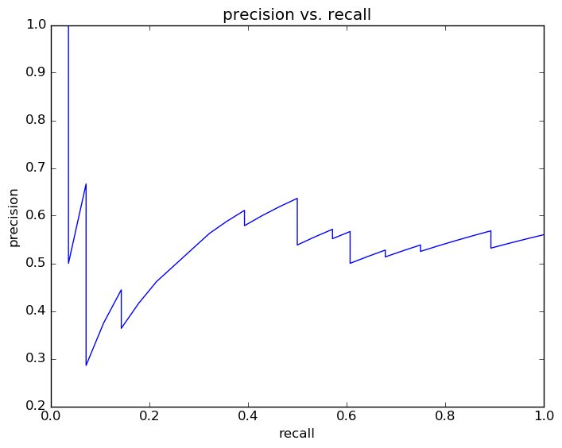
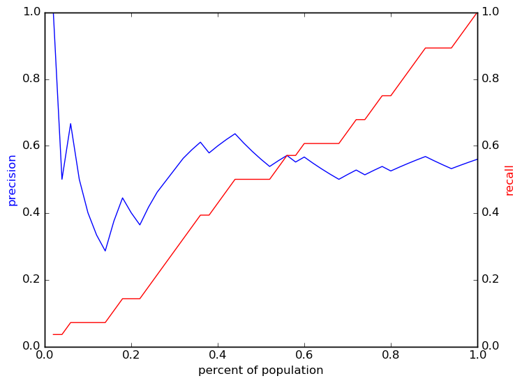
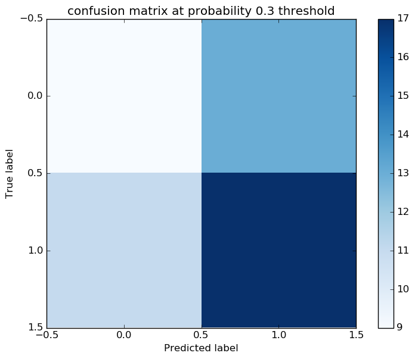
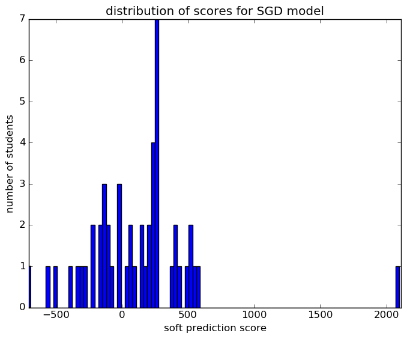

# Report for param set 25 SGD
testing all options by looping throughwith a just 100 students

### Model Options
* label used: definite
* initial cohort grade: 9
* test cohorts: 2011, 2012
	 * 28 positive examples, 22 negative examples
* train cohorts: 2007, 2008, 2009, 2010
	 * 19 postive examples, 22 negative examples
* cross-validation scheme: past cohorts only
	 * searching loss in hinge
	 * chose loss = hinge
	 * searching penalty in l2
	 * chose penalty = l2
	 * using ['custom_precision_5', 'f1']
* imputation strategy: median plus dummies
* scaling strategy: robust

### Features Used
* demographics
	 * gender
	 * ethnicity
* snapshots
	 * oss_gr_8
	 * section_504_plan_gr_8
	 * special_ed_gr_8
	 * district_gr_8
	 * days_absent_gr_8
	 * iss_gr_8
	 * days_present_gr_8
	 * disability_gr_8
	 * days_absent_unexcused_gr_8
	 * discipline_incidents_gr_8
	 * limited_english_gr_8
	 * status_gr_8
	 * gifted_gr_8
	 * days_absent_excused_gr_8
	 * disadvantagement_gr_8
* grades
	 * gpa_gr_8
* oaa_normalized
	 * third_math_percentile
	 * sixth_math_pl
	 * fifth_math_pl
	 * fourth_read_normalized
	 * eighth_math_pl
	 * sixth_math_percentile
	 * fourth_math_normalized
	 * seventh_read_pl
	 * seventh_math_percentile
	 * eighth_math_normalized
	 * seventh_read_percentile
	 * fifth_math_normalized
	 * seventh_math_normalized
	 * fifth_read_normalized
	 * eighth_read_percentile
	 * fifth_socstudies_normalized
	 * sixth_read_normalized
	 * seventh_read_normalized
	 * eighth_science_percentile
	 * fourth_read_percentile
	 * fifth_read_percentile
	 * fifth_math_percentile
	 * fifth_read_pl
	 * fifth_science_percentile
	 * third_read_percentile
	 * sixth_read_percentile
	 * sixth_math_normalized
	 * fifth_science_normalized
	 * eighth_science_pl
	 * third_read_pl
	 * fourth_math_pl
	 * fifth_socstudies_pl
	 * eighth_read_normalized
	 * eighth_read_pl
	 * eighth_math_percentile
	 * third_math_normalized
	 * fifth_science_pl
	 * eighth_science_normalized
	 * sixth_read_pl
	 * fourth_read_pl
	 * fourth_math_percentile
	 * seventh_math_pl
	 * third_read_normalized
	 * third_math_pl

### Performance Metrics
on average, model run in 0.00 seconds (1 times)  precision on top 15%: 0.375  precision on top 10%: 0.3333  precision on top 5%: 0.6667  recall on top 15%: 0.1071  recall on top 10%: 0.07143  recall on top 5%: 0.07143  AUC value is: 0.4594  top features: fourth_math_normalized (1.2e+02), discipline_incidents_gr_8 (1e+02), fourth_math_percentile (9.5e+01)

