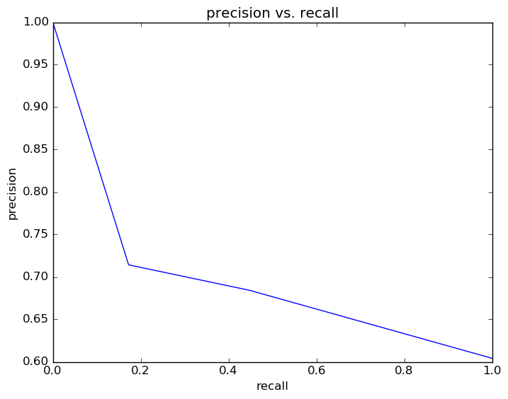
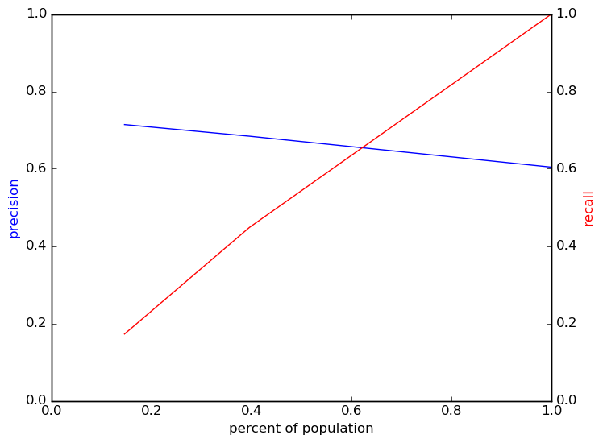
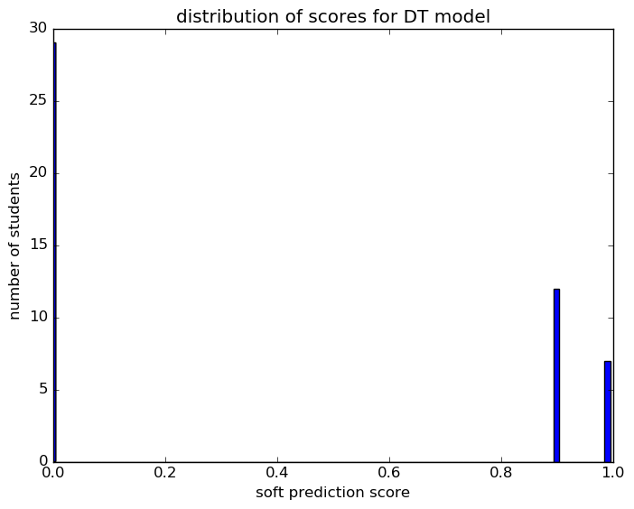
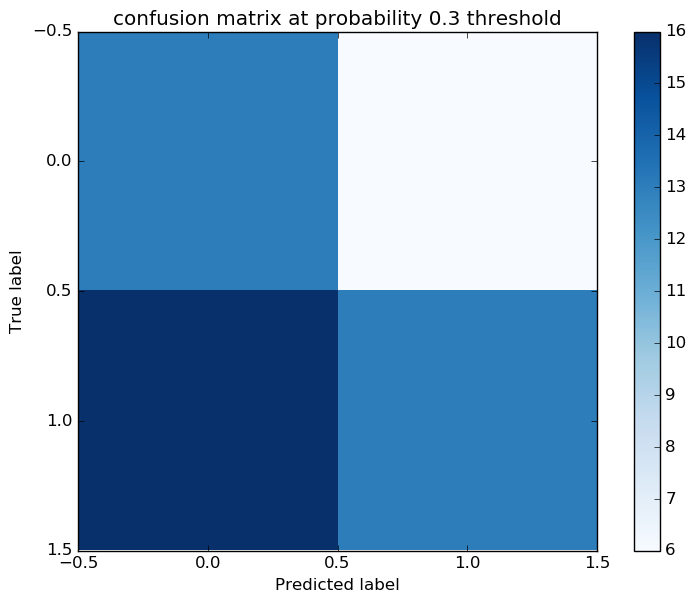

# Report for param set 9 DT
testing all options by looping throughwith a just 100 students

### Model Options
* label used: definite
* initial cohort grade: 9
* test cohorts: 2011, 2012
	 * 29 positive examples, 19 negative examples
* train cohorts: 2007, 2008, 2009, 2010
	 * 18 postive examples, 27 negative examples
* cross-validation scheme: leave cohort out
	 * searching max_depth in 5
	 * chose max_depth = 5
	 * searching criterion in entropy
	 * chose criterion = entropy
	 * using ['custom_precision_5', 'f1']
* imputation strategy: median plus dummies
* scaling strategy: robust

### Features Used
* demographics
	 * gender
	 * ethnicity
* snapshots
	 * oss_gr_8
	 * section_504_plan_gr_8
	 * special_ed_gr_8
	 * district_gr_8
	 * days_absent_gr_8
	 * iss_gr_8
	 * days_present_gr_8
	 * disability_gr_8
	 * days_absent_unexcused_gr_8
	 * discipline_incidents_gr_8
	 * limited_english_gr_8
	 * status_gr_8
	 * gifted_gr_8
	 * days_absent_excused_gr_8
	 * disadvantagement_gr_8
* grades
	 * gpa_gr_8
* oaa_normalized
	 * third_math_percentile
	 * sixth_math_pl
	 * fifth_math_pl
	 * fourth_read_normalized
	 * eighth_math_pl
	 * sixth_math_percentile
	 * fourth_math_normalized
	 * seventh_read_pl
	 * seventh_math_percentile
	 * eighth_math_normalized
	 * seventh_read_percentile
	 * fifth_math_normalized
	 * seventh_math_normalized
	 * fifth_read_normalized
	 * eighth_read_percentile
	 * fifth_socstudies_normalized
	 * sixth_read_normalized
	 * seventh_read_normalized
	 * eighth_science_percentile
	 * fourth_read_percentile
	 * fifth_read_percentile
	 * fifth_math_percentile
	 * fifth_read_pl
	 * fifth_science_percentile
	 * third_read_percentile
	 * sixth_read_percentile
	 * sixth_math_normalized
	 * fifth_science_normalized
	 * eighth_science_pl
	 * third_read_pl
	 * fourth_math_pl
	 * fifth_socstudies_pl
	 * eighth_read_normalized
	 * eighth_read_pl
	 * eighth_math_percentile
	 * third_math_normalized
	 * fifth_science_pl
	 * eighth_science_normalized
	 * sixth_read_pl
	 * fourth_read_pl
	 * fourth_math_percentile
	 * seventh_math_pl
	 * third_read_normalized
	 * third_math_pl

### Performance Metrics
on average, model run in 0.02 seconds (1 times)  precision on top 15%: 0.6842  precision on top 10%: 0.7143  precision on top 5%: 0.7143  recall on top 15%: 0.4483  recall on top 10%: 0.1724  recall on top 5%: 0.1724  AUC value is: 0.5699  top features: fourth_read_normalized (0.41), fifth_read_normalized (0.23), sixth_read_percentile (0.18)

