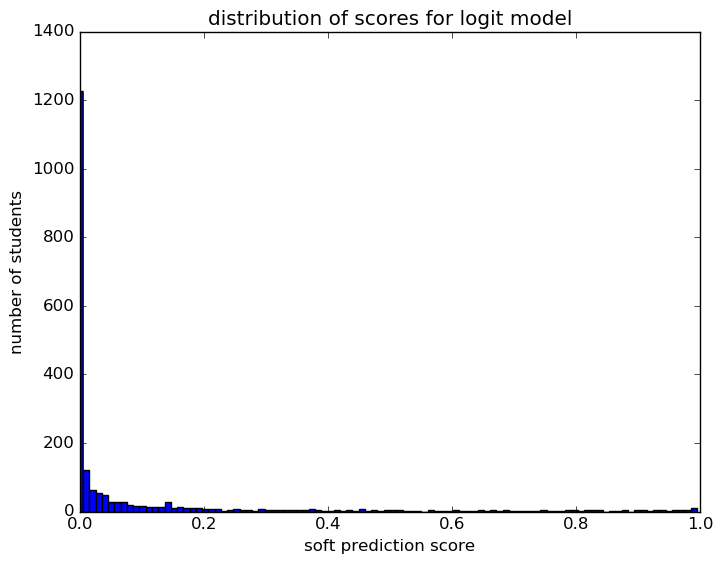
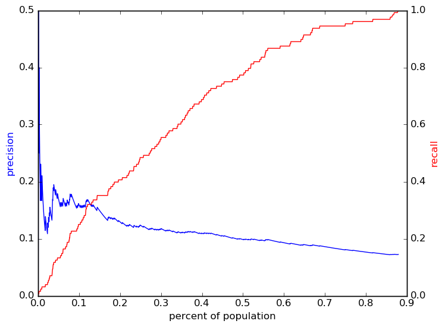
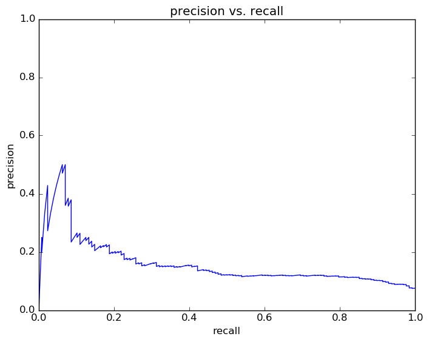
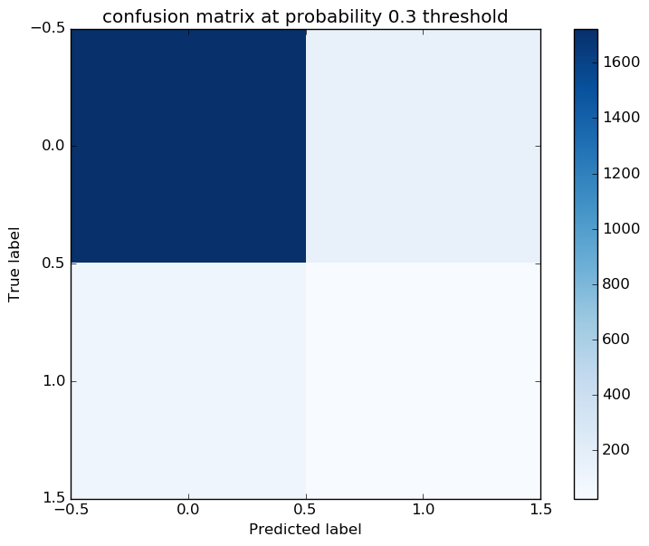
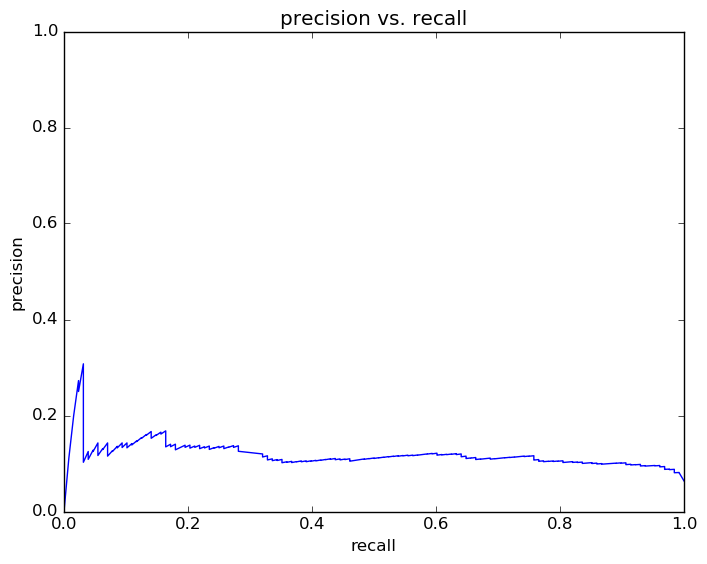
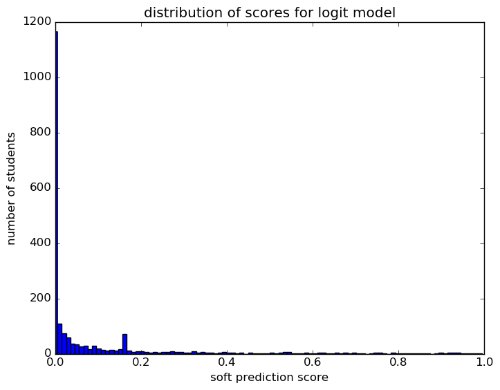
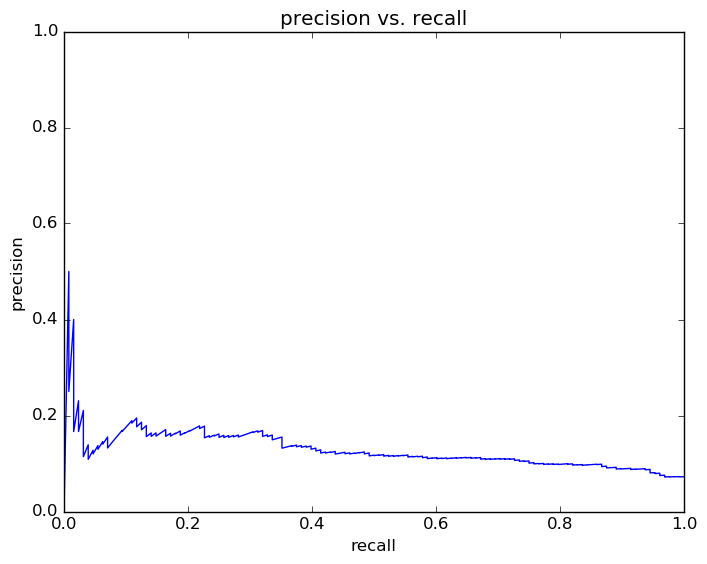
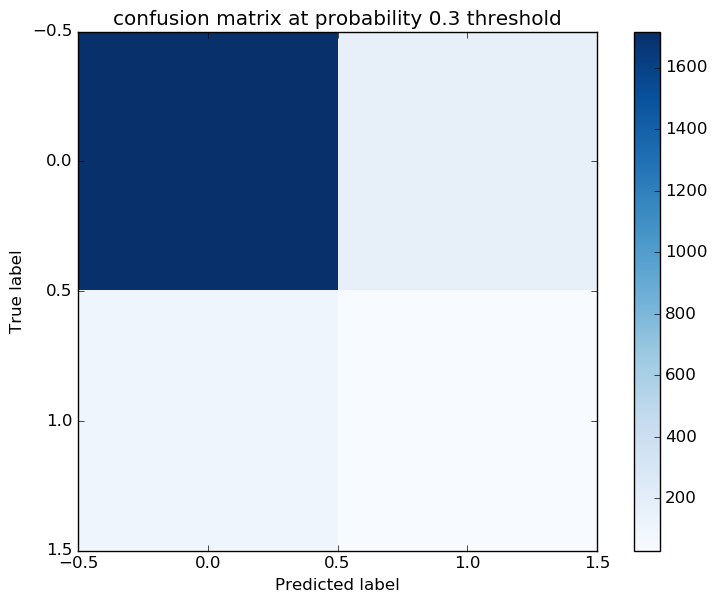
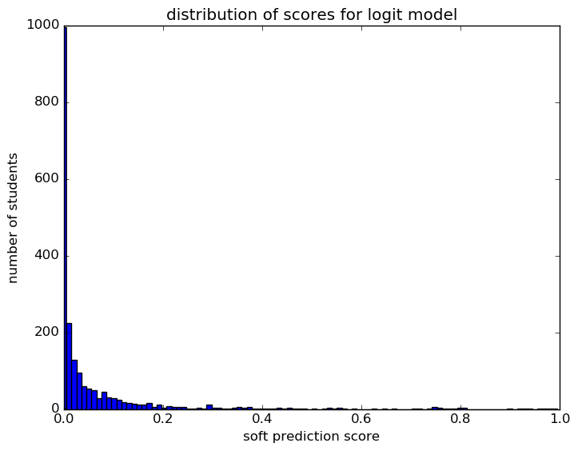
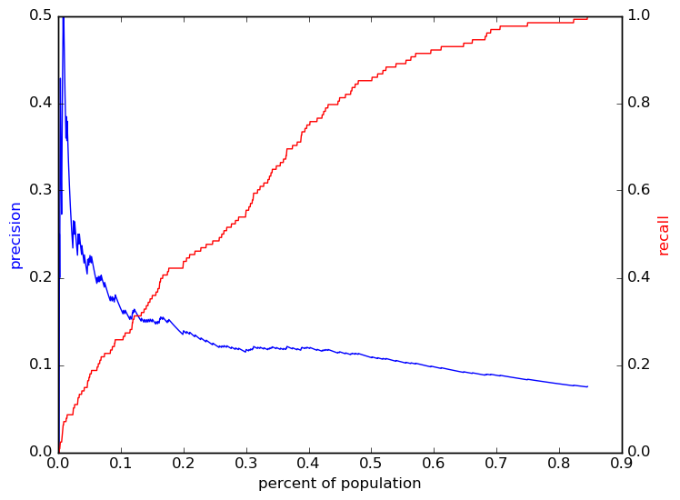

# Report for predict10 0802 demo gr oaa logit
predict at begin of 10th for weekly update ZZ

### Model Options
* label used: definite
* initial cohort grade: 9
* test cohorts: 2011
	 * 128 positive examples, 1881 negative examples
* train cohorts: 2008, 2009, 2010
	 * 96 postive examples, 3046 negative examples
* cross-validation scheme: leave cohort out
	 * searching penalty in l1, l2
	 * chose penalty = l1
	 * searching C in 0.001, 0.01, 0.1, 1.0, 10.0, 100, 1000
	 * chose C = 100
	 * using custom_precision_10
* imputation strategy: median plus dummies
* scaling strategy: robust

### Features Used
* grades
	 * gpa_gr_8
	 * gpa_gr_9
	 * gpa_gr_7
* oaa_normalized
	 * seventh_read_normalized
	 * sixth_math_percentile
	 * fifth_socstudies_pl
	 * seventh_read_percentile
	 * sixth_read_pl
	 * fifth_science_normalized
	 * fourth_read_percentile
	 * eighth_science_percentile
	 * sixth_read_normalized
	 * fourth_math_percentile
	 * fourth_read_pl
	 * eighth_read_pl
	 * fourth_math_pl
	 * fifth_math_normalized
	 * fourth_math_normalized
	 * sixth_math_normalized
	 * fifth_math_percentile
	 * seventh_math_normalized
	 * fifth_read_normalized
	 * third_read_pl
	 * fifth_science_pl
	 * eighth_science_normalized
	 * third_read_percentile
	 * sixth_math_pl
	 * seventh_math_percentile
	 * eighth_read_percentile
	 * third_read_normalized
	 * sixth_read_percentile
	 * eighth_math_normalized
	 * eighth_read_normalized
	 * third_math_normalized
	 * eighth_science_p
	 * fourth_read_normalized
	 * third_math_pl
	 * fifth_socstudies_normalized
	 * seventh_math_pl
	 * fifth_read_pl
	 * third_math_percentile
	 * seventh_read_pl
	 * fifth_math_pl
	 * eighth_math_pl
	 * fifth_science_percentile
	 * fifth_read_percentile
	 * eighth_math_percentile

### Performance Metrics
on average, model run in 2.03 seconds (14 times)  precision on top 15%: 0.1199  precision on top 10%: 0.1343  precision on top 5%: 0.1386  recall on top 15%: 0.3203  recall on top 10%: 0.2109  recall on top 5%: 0.1094  AUC value is: 0.7154  top features: fifth_science_percentile (1.7e+01), third_math_percentile (1.1e+01), fourth_math_pl_Limited (7.7)

