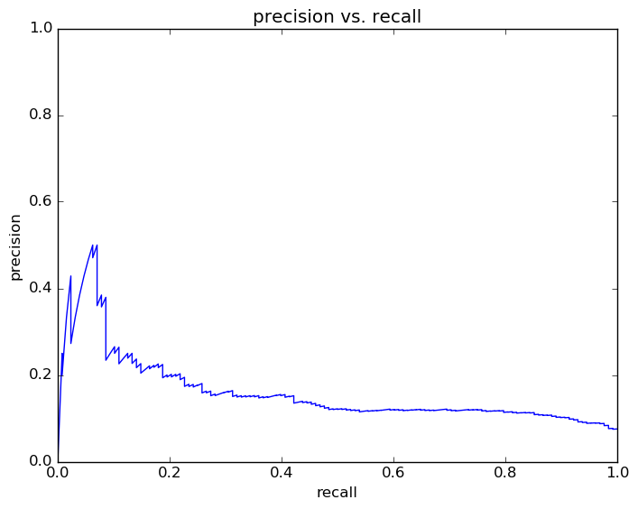
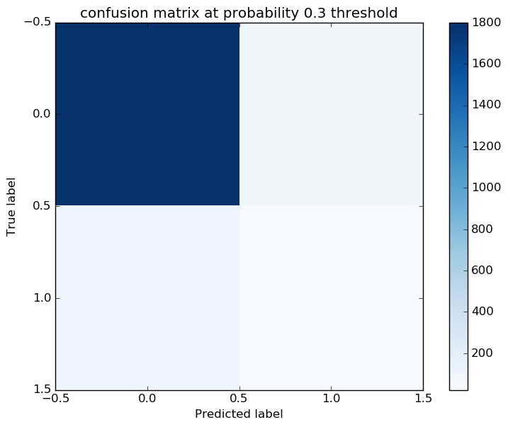
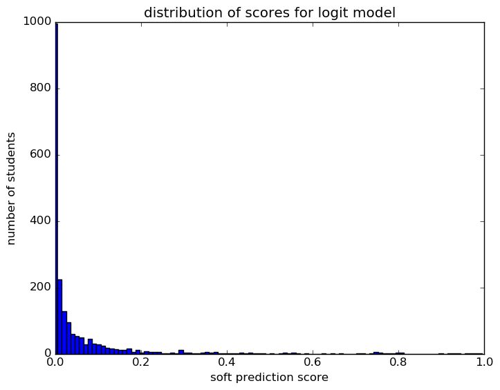
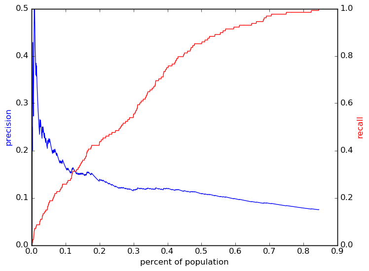

# Report for predict10 0802 demo gr oaa snap mob logit
predict at begin of 10th for weekly update ZZ

### Model Options
* label used: definite
* initial cohort grade: 9
* test cohorts: 2011
	 * 128 positive examples, 1881 negative examples
* train cohorts: 2008, 2009, 2010
	 * 96 postive examples, 3046 negative examples
* cross-validation scheme: leave cohort out
	 * searching penalty in l1, l2
	 * chose penalty = l2
	 * searching C in 0.001, 0.01, 0.1, 1.0, 10.0, 100, 1000
	 * chose C = 1.0
	 * using custom_precision_10
* imputation strategy: median plus dummies
* scaling strategy: robust

### Features Used
* mobility
	 * n_records_to_gr_7
	 * city_transition_in_gr_9
	 * mid_year_withdraw_gr_9
	 * city_transition_in_gr_7
	 * avg_address_change_to_gr_8
	 * n_districts_to_gr_9
	 * n_addresses_to_gr_7
	 * n_districts_to_gr_8
	 * avg_district_change_to_gr_8
	 * district_transition_in_gr_8
	 * avg_city_change_to_gr_9
	 * n_addresses_to_gr_9
	 * street_transition_in_gr_7
	 * city_transition_in_gr_8
	 * avg_city_change_to_gr_8
	 * mid_year_withdraw_gr_7
	 * street_transition_in_gr_8
	 * avg_address_change_to_gr_7
	 * n_records_to_gr_9
	 * avg_district_change_to_gr_9
	 * street_transition_in_gr_9
	 * avg_address_change_to_gr_9
	 * avg_district_change_to_gr_7
	 * n_districts_to_gr_7
	 * district_transition_in_gr_9
	 * n_cities_to_gr_8
	 * n_addresses_to_gr_8
	 * n_records_to_gr_8
	 * n_cities_to_gr_9
	 * district_transition_in_gr_7
	 * n_cities_to_gr_7
	 * mid_year_withdraw_gr_8
	 * avg_city_change_to_gr_7
* oaa_normalized
	 * eighth_math_pl
	 * fifth_science_pl
	 * fifth_science_normalized
	 * third_read_normalized
	 * fourth_read_percentile
	 * eighth_read_percentile
	 * fifth_socstudies_pl
	 * fourth_math_pl
	 * seventh_math_percentile
	 * eighth_science_percentile
	 * fourth_math_normalized
	 * eighth_math_percentile
	 * fifth_read_percentile
	 * fifth_read_pl
	 * seventh_read_percentile
	 * seventh_math_normalized
	 * fifth_socstudies_normalized
	 * third_read_pl
	 * sixth_read_percentile
	 * fifth_math_percentile
	 * sixth_math_normalized
	 * third_math_normalized
	 * seventh_math_pl
	 * seventh_read_normalized
	 * eighth_science_p
	 * sixth_math_pl
	 * third_math_pl
	 * fifth_math_pl
	 * seventh_read_pl
	 * fourth_read_pl
	 * fifth_read_normalized
	 * eighth_read_pl
	 * sixth_read_pl
	 * third_math_percentile
	 * sixth_math_percentile
	 * fourth_read_normalized
	 * eighth_science_normalized
	 * eighth_math_normalized
	 * third_read_percentile
	 * fourth_math_percentile
	 * fifth_math_normalized
	 * eighth_read_normalized
	 * fifth_science_percentile
	 * sixth_read_normalized
* snapshots
	 * oss_gr_8
	 * discipline_incidents_gr_9
	 * disadvantagement_gr_7
	 * disability_gr_8
	 * iss_gr_8
	 * special_ed_gr_9
	 * oss_gr_7
	 * special_ed_gr_7
	 * gifted_gr_7
	 * limited_english_gr_7
	 * disadvantagement_gr_8
	 * gifted_gr_9
	 * iss_gr_9
	 * disability_gr_7
	 * district_gr_7
	 * days_absent_gr_8
	 * days_absent_unexcused_gr_8
	 * limited_english_gr_8
	 * disability_gr_9
	 * days_absent_gr_9
	 * limited_english_gr_9
	 * district_gr_9
	 * district_gr_8
	 * gifted_gr_8
	 * discipline_incidents_gr_8
	 * oss_gr_9
	 * days_absent_unexcused_gr_9
	 * days_absent_unexcused_gr_7
	 * discipline_incidents_gr_7
	 * special_ed_gr_8
	 * disadvantagement_gr_9
	 * iss_gr_7
	 * days_absent_gr_7
* grades
	 * gpa_gr_9
	 * gpa_gr_8
	 * gpa_gr_7

### Performance Metrics
on average, model run in 3.53 seconds (14 times)  precision on top 15%: 0.1523  precision on top 10%: 0.1642  precision on top 5%: 0.2178  recall on top 15%: 0.3594  recall on top 10%: 0.2578  recall on top 5%: 0.1719  AUC value is: 0.7425  top features: gpa_gr_9_isnull (1.5), eighth_read_pl_Accelerated (1.0), gpa_gr_7_isnull (0.97)

