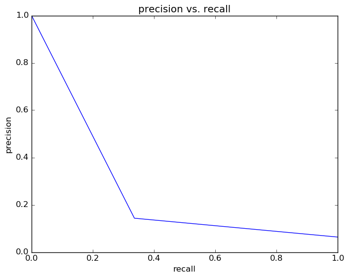
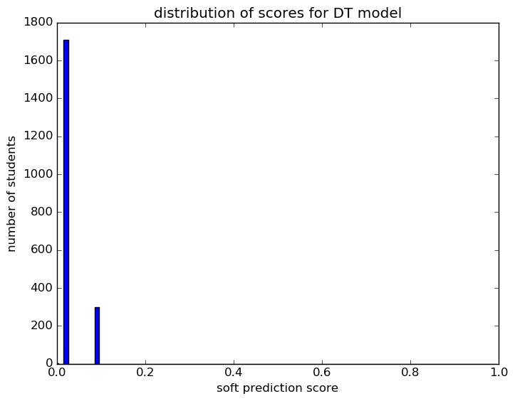
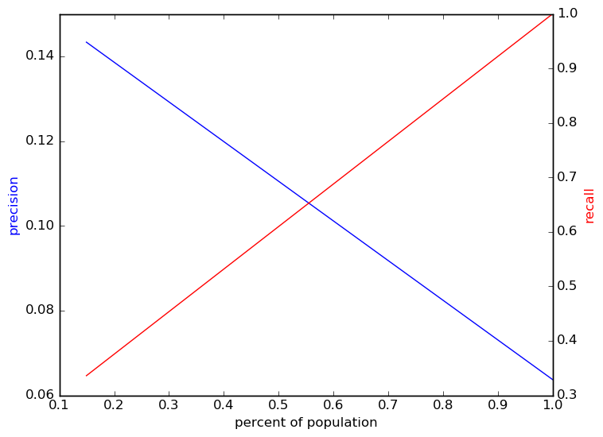

# Report for predict9 0802 demo all DT
predict at end of 9th for weekly update ZZ ALL

### Model Options
* label used: definite
* initial cohort grade: 9
* test cohorts: 2011
	 * 128 positive examples, 1881 negative examples
* train cohorts: 2008, 2009, 2010
	 * 96 postive examples, 3046 negative examples
* cross-validation scheme: leave cohort out
	 * searching criterion in gini, entropy
	 * chose criterion = gini
	 * searching max_depth in 1, 5, 10, 20, 50, 100
	 * chose max_depth = 1
	 * searching max_features in sqrt, log2
	 * chose max_features = sqrt
	 * searching min_samples_split in 2, 5, 10
	 * chose min_samples_split = 2
	 * using custom_precision_10
* imputation strategy: median plus dummies
* scaling strategy: robust

### Features Used
* oaa_normalized
	 * eighth_read_percentile
	 * fifth_math_pl
	 * sixth_read_normalized
	 * fourth_math_pl
	 * fifth_math_percentile
	 * fifth_socstudies_pl
	 * sixth_read_percentile
	 * sixth_math_percentile
	 * fifth_science_pl
	 * eighth_math_percentile
	 * fourth_read_normalized
	 * fourth_read_pl
	 * third_read_percentile
	 * eighth_read_pl
	 * fifth_socstudies_normalized
	 * fifth_read_percentile
	 * fifth_read_pl
	 * eighth_math_pl
	 * third_read_normalized
	 * fifth_math_normalized
	 * eighth_math_normalized
	 * seventh_read_pl
	 * sixth_math_pl
	 * fourth_read_percentile
	 * seventh_read_normalized
	 * fourth_math_normalized
	 * seventh_math_percentile
	 * seventh_math_normalized
	 * third_math_percentile
	 * fifth_read_normalized
	 * third_math_normalized
	 * eighth_read_normalized
	 * eighth_science_percentile
	 * eighth_science_p
	 * seventh_math_pl
	 * eighth_science_normalized
	 * third_math_pl
	 * sixth_read_pl
	 * fifth_science_percentile
	 * fourth_math_percentile
	 * third_read_pl
	 * sixth_math_normalized
	 * fifth_science_normalized
	 * seventh_read_percentile
* grades
	 * gpa_gr_8
	 * gpa_gr_7

### Performance Metrics
on average, model run in 0.07 seconds (72 times)  precision on top 15%: 0.06371  precision on top 10%: 0.1433  precision on top 5%: 0.1433  recall on top 15%: 1.0  recall on top 10%: 0.3359  recall on top 5%: 0.3359  AUC value is: 0.5997  top features: eighth_math_percentile (1.0), fifth_math_pl_99 (0.0), fifth_math_pl_Accelerated (0.0)

