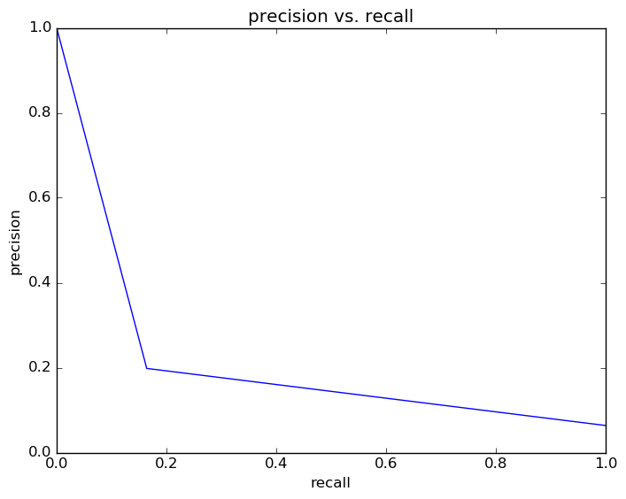
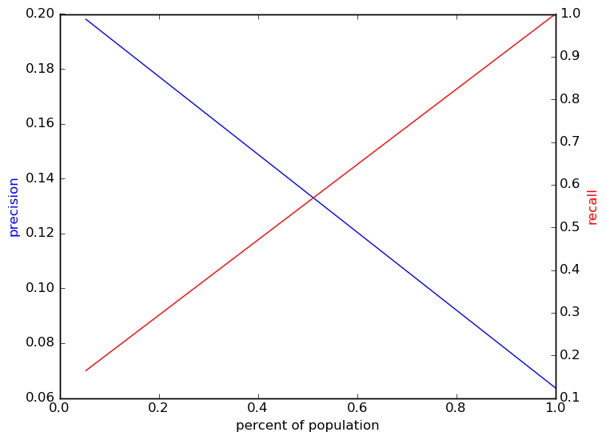
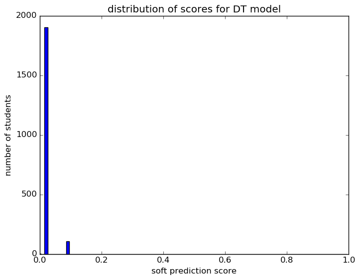

# Report for predict9 0802 demo snap DT
predict at end of 9th for weekly update ZZ

### Model Options
* label used: definite
* initial cohort grade: 9
* test cohorts: 2011
	 * 128 positive examples, 1881 negative examples
* train cohorts: 2008, 2009, 2010
	 * 96 postive examples, 3046 negative examples
* cross-validation scheme: leave cohort out
	 * searching criterion in gini, entropy
	 * chose criterion = gini
	 * searching max_features in sqrt, log2
	 * chose max_features = sqrt
	 * searching max_depth in 1, 5, 10, 20, 50, 100
	 * chose max_depth = 1
	 * searching min_samples_split in 2, 5, 10
	 * chose min_samples_split = 2
	 * using custom_precision_10
* imputation strategy: median plus dummies
* scaling strategy: robust

### Features Used
* snapshots
	 * disability_gr_7
	 * iss_gr_8
	 * special_ed_gr_8
	 * limited_english_gr_8
	 * disability_gr_8
	 * days_absent_gr_7
	 * disadvantagement_gr_8
	 * days_absent_unexcused_gr_7
	 * district_gr_7
	 * oss_gr_8
	 * oss_gr_7
	 * discipline_incidents_gr_8
	 * discipline_incidents_gr_7
	 * gifted_gr_7
	 * limited_english_gr_7
	 * gifted_gr_8
	 * days_absent_gr_8
	 * days_absent_unexcused_gr_8
	 * district_gr_8
	 * special_ed_gr_7
	 * disadvantagement_gr_7
	 * iss_gr_7

### Performance Metrics
on average, model run in 0.04 seconds (72 times)  precision on top 15%: 0.06371  precision on top 10%: 0.06371  precision on top 5%: 0.1981  recall on top 15%: 1.0  recall on top 10%: 1.0  recall on top 5%: 0.1641  AUC value is: 0.5594  top features: days_absent_gr_8 (1.0), disability_gr_7_autism (0.0), disability_gr_7_cognitive disability (0.0)

