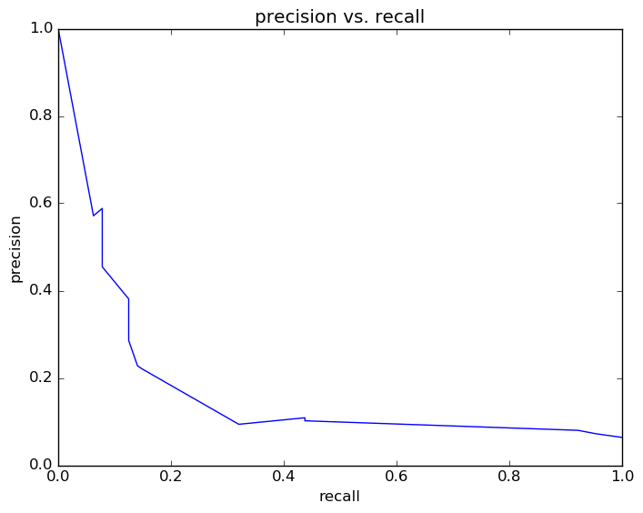
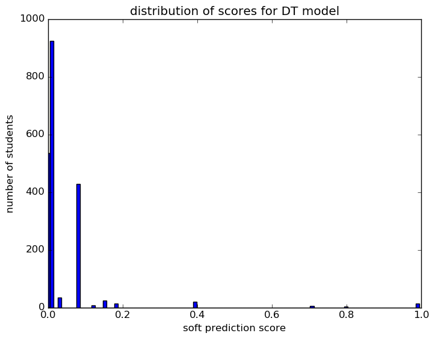

# Report for test DT
testing all options by looping through with a just 500 students

### Model Options
* label used: not_on_time
* initial cohort grade: 9
* test cohorts: 2011, 2012
	 * 46 positive examples, 172 negative examples
* train cohorts: 2007, 2008, 2009, 2010
	 * 64 postive examples, 166 negative examples
* cross-validation scheme: k fold, with 10 folds
	 * searching max_depth in 5
	 * chose max_depth = 5
	 * searching criterion in entropy
	 * chose criterion = entropy
	 * using ['custom_precision_5']
* imputation strategy: median plus dummies
* scaling strategy: robust

### Features Used
* absence
	 * tardy_gr_8
	 * tardy_consec_gr_8
	 * absence_consec_gr_8
	 * absence_unexcused_gr_8
	 * medical_gr_8
	 * tardy_unexcused_gr_8
	 * absence_gr_8

### Performance Metrics
on average, model run in 0.07 seconds (1 times)  precision on top 15%: 0.2206  precision on top 10%: 0.2206  precision on top 5%: 0.2206  recall on top 15%: 0.3261  recall on top 10%: 0.3261  recall on top 5%: 0.3261  AUC value is: 0.5849  top features: absence_gr_8 (0.83), medical_gr_8 (0.12), absence_unexcused_gr_8 (0.049)

