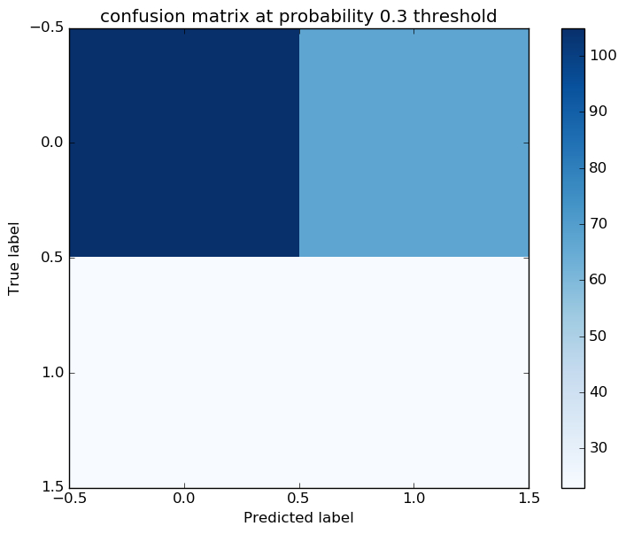
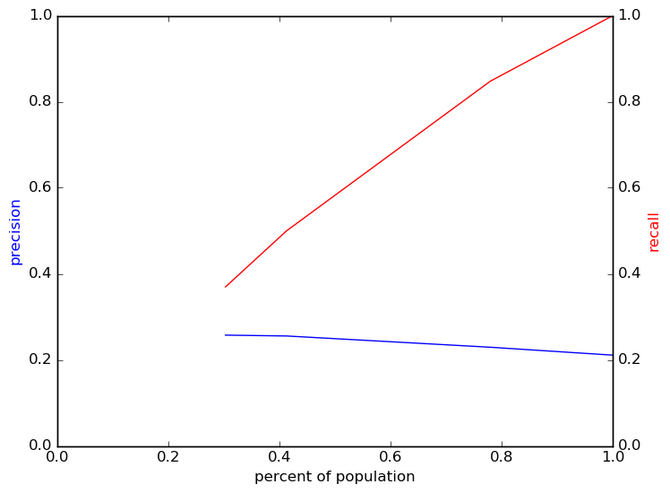
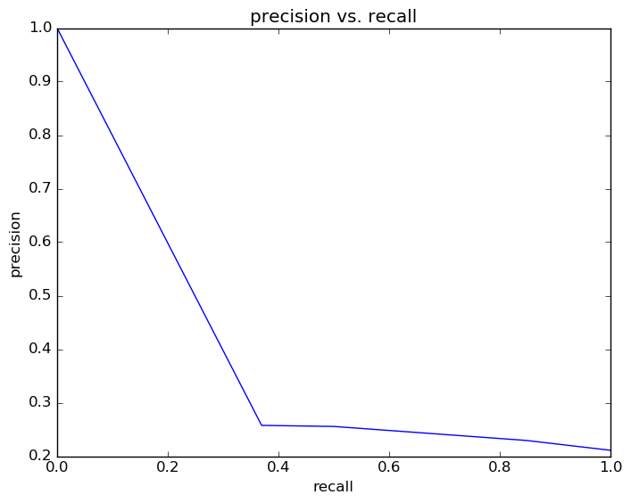
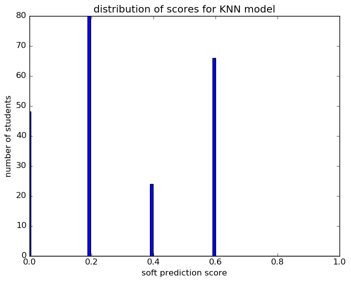

# Report for test KNN
testing all options by looping through with a just 500 students

### Model Options
* label used: not_on_time
* initial cohort grade: 9
* test cohorts: 2011, 2012
	 * 46 positive examples, 172 negative examples
* train cohorts: 2007, 2008, 2009, 2010
	 * 64 postive examples, 166 negative examples
* cross-validation scheme: k fold, with 10 folds
	 * searching n_neighbors in 5
	 * chose n_neighbors = 5
	 * using ['custom_precision_5']
* imputation strategy: median plus dummies
* scaling strategy: robust

### Features Used
* absence
	 * tardy_gr_8
	 * tardy_consec_gr_8
	 * absence_consec_gr_8
	 * absence_unexcused_gr_8
	 * medical_gr_8
	 * tardy_unexcused_gr_8
	 * absence_gr_8

### Performance Metrics
on average, model run in 0.08 seconds (1 times)  precision on top 15%: 0.2576  precision on top 10%: 0.2576  precision on top 5%: 0.2576  recall on top 15%: 0.3696  recall on top 10%: 0.3696  recall on top 5%: 0.3696  AUC value is: 0.5691  

