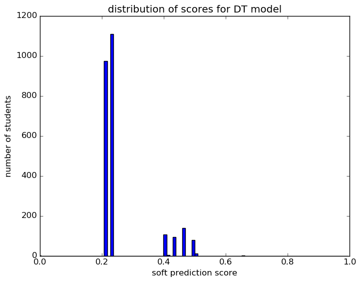
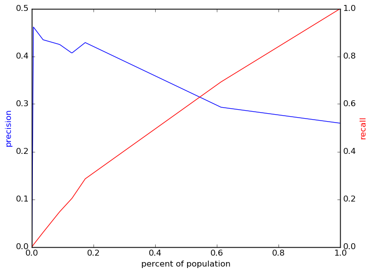
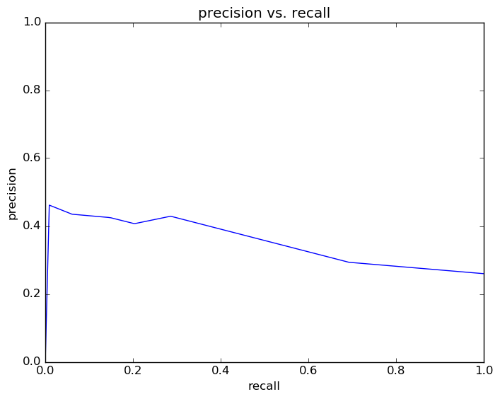
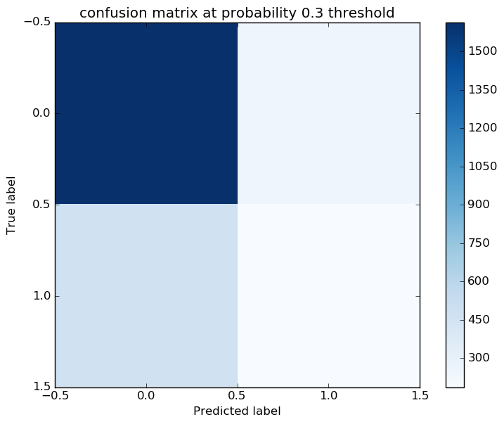

# Report for test gender ethnicity not on time DT
initial_skeleton_pipeline_test

### Model Options
* label used: not_on_time
* initial cohort grade: 9
* test cohorts: 2011
	 * 654 positive examples, 1864 negative examples
* train cohorts: 2006, 2007, 2008, 2009, 2010
	 * 1593 postive examples, 4966 negative examples
* cross-validation scheme: leave cohort out
	 * searching criterion in entropy
	 * chose criterion = entropy
	 * searching max_depth in 5
	 * chose max_depth = 5
	 * using accuracy
* imputation strategy: median plus dummies
* scaling strategy: robust

### Features Used
* demographics
	 * ethnicity
	 * gender

### Performance Metrics
on average, model run in 0.07 seconds (1 times)  precision on top 10%: 0.407  precision on top 5%: 0.425  top features: ethnicity_M (0.53), ethnicity_B (0.3), gender_F (0.06)

