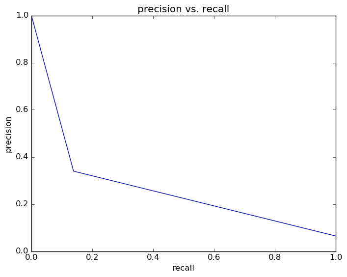

# Report for test reporting DT
testing the reporting functions

### Model Options
* label used: definite
* initial cohort grade: 9
* test cohorts: 2011
	 * 130 positive examples, 1883 negative examples
* train cohorts: 2006, 2007, 2008, 2009, 2010
	 * 152 postive examples, 5045 negative examples
* cross-validation scheme: leave cohort out
	 * searching max_depth in 1, 5, 10, 20, 50, 100
	 * chose max_depth = 1
	 * searching criterion in gini, entropy
	 * chose criterion = gini
	 * searching min_samples_split in 2, 5, 10
	 * chose min_samples_split = 2
	 * searching max_features in sqrt, log2
	 * chose max_features = log2
	 * using average_precision
* imputation strategy: median plus dummies
* scaling strategy: none

### Features Used
* absence
	 * days_absent_gr_9
	 * days_absent_unexcused_gr_9
	 * discipline_incidents_gr_9
	 * tardy_gr_9
	 * tardy_unexcused_gr_9
* demographics
	 * ethnicity
	 * gender
* grades
	 * gpa_gr_9

### Performance Metrics

