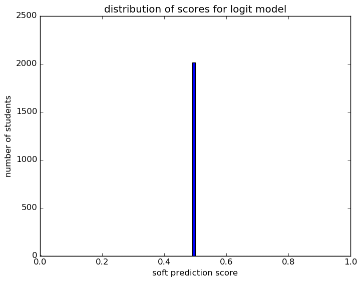
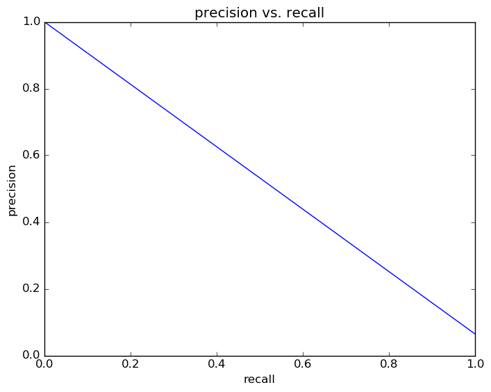

# Report for test reporting logit
this run is used to test the reporting functions

### Model Options
* label used: not_on_time
* initial cohort grade: 9
* test cohorts: 2011
* train cohorts: all except test/val
* cross-validation scheme: temporal cohort
	 * using accuracy
* imputation strategy: median plus dummies

### Features Used
* grades
	 * gpa_gr_9
* demographics
	 * ethnicity
	 * gender

### Performance Metrics

