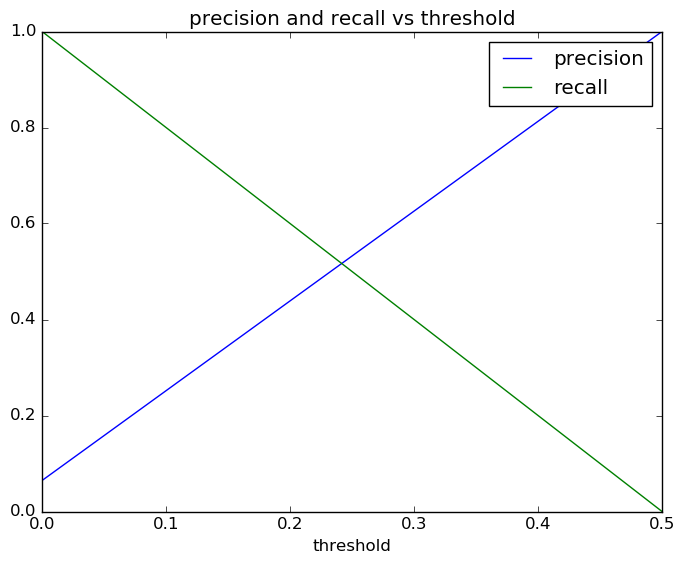
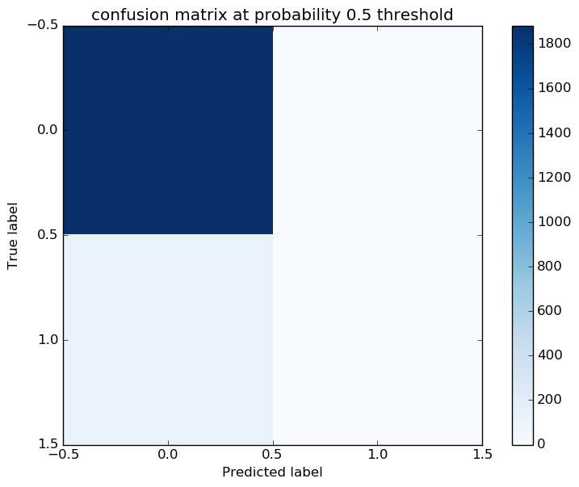

# Report for test reporting logit
testing the reporting functions

### Model Options
* label used: definite
* initial cohort grade: 9
* test cohorts: 2011
	 * 130 positive examples, 1883 negative examples
* train cohorts: 2006, 2007, 2008, 2009, 2010
	 * 152 postive examples, 5045 negative examples
* cross-validation scheme: leave cohort out
	 * using average_precision
* imputation strategy: median plus dummies
* scaling strategy: none

### Features Used
* demographics
	 * ethnicity
	 * gender
* absence
	 * days_absent_gr_9
	 * days_absent_unexcused_gr_9
	 * discipline_incidents_gr_9
	 * tardy_gr_9
	 * tardy_unexcused_gr_9
* grades
	 * gpa_gr_9

### Performance Metrics
top features: days_absent_gr_9 (0.0), days_absent_unexcused_gr_9 (0.0), discipline_incidents_gr_9 (0.0)

