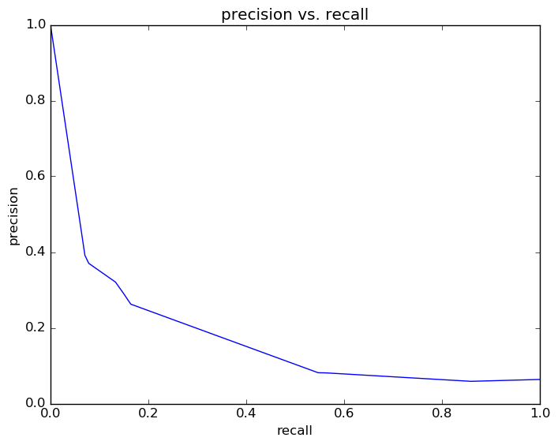

# Report for testing write to database DT
expand features and grade range

### Model Options
* label used: definite
* initial cohort grade: 9
* test cohorts: 2011
	 * 128 positive examples, 1881 negative examples
* train cohorts: 2009, 2010
	 * 65 postive examples, 2062 negative examples
* cross-validation scheme: leave cohort out
	 * searching max_depth in 5
	 * chose max_depth = 5
	 * searching criterion in entropy
	 * chose criterion = entropy
	 * using custom_recall_10
* imputation strategy: median plus dummies
* scaling strategy: robust

### Features Used
* demographics
	 * ethnicity
	 * gender
* mobility
	 * n_addresses_to_gr_9
	 * n_cities_to_gr_9
	 * n_districts_to_gr_9
	 * n_addresses_to_gr_8
	 * n_districts_to_gr_8
	 * n_cities_to_gr_8
* snapshots
	 * days_absent_unexcused_gr_9
	 * status_gr_9
	 * limited_english_gr_9
	 * days_absent_gr_8
	 * discipline_incidents_gr_8
	 * days_absent_unexcused_gr_8
	 * discipline_incidents_gr_9
	 * days_absent_gr_9
	 * iss_gr_8
	 * special_ed_gr_9
	 * gifted_gr_8
	 * disadvantagement_gr_9
	 * gifted_gr_9
	 * disability_gr_9
	 * oss_gr_8
	 * oss_gr_9
	 * disadvantagement_gr_8
	 * district_gr_8
	 * limited_english_gr_8
	 * special_ed_gr_8
	 * iss_gr_9
	 * status_gr_8
	 * district_gr_9
	 * disability_gr_8
* grades
	 * gpa_gr_9
	 * gpa_gr_8

### Performance Metrics
on average, model run in 0.05 seconds (1 times)  precision on top 10%: 0.0815  precision on top 5%: 0.0815  top features: gpa_gr_9 (0.33), days_absent_gr_9 (0.11), gpa_gr_8 (0.1)

