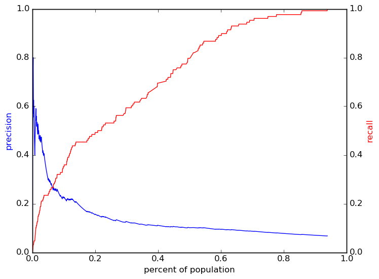
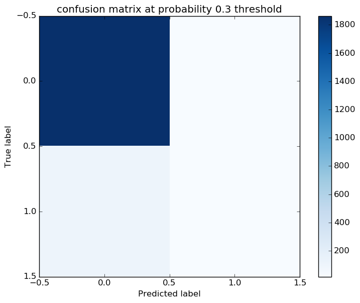
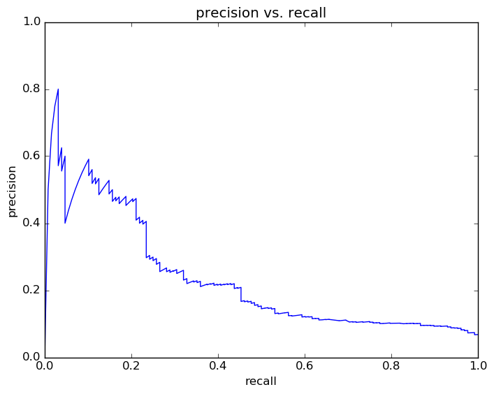

# Report for testing write to database logit
expand features and grade range

### Model Options
* label used: definite
* initial cohort grade: 9
* test cohorts: 2011
	 * 128 positive examples, 1881 negative examples
* train cohorts: 2009, 2010
	 * 65 postive examples, 2062 negative examples
* cross-validation scheme: leave cohort out
	 * searching penalty in l1
	 * chose penalty = l1
	 * searching C in 1.0
	 * chose C = 1.0
	 * using custom_recall_10
* imputation strategy: median plus dummies
* scaling strategy: robust

### Features Used
* mobility
	 * n_addresses_to_gr_9
	 * n_addresses_to_gr_8
	 * n_cities_to_gr_8
	 * n_districts_to_gr_8
	 * n_cities_to_gr_9
	 * n_districts_to_gr_9
* grades
	 * gpa_gr_8
	 * language_gpa_gr_9
	 * humanities_gpa_gr_9
	 * stem_gpa_gr_8
	 * num_humanities_classes_gr_9
	 * num_language_classes_gr_9
	 * num_language_classes_gr_8
	 * stem_gpa_gr_9
	 * gpa_gr_9
	 * num_humanities_classes_gr_8
	 * num_stem_classes_gr_9
	 * humanities_gpa_gr_8
	 * num_stem_classes_gr_8
	 * language_gpa_gr_8
* snapshots
	 * oss_gr_8
	 * oss_gr_9
	 * days_absent_unexcused_gr_8
	 * district_gr_9
	 * disadvantagement_gr_8
	 * days_absent_gr_9
	 * days_absent_unexcused_gr_9
	 * gifted_gr_8
	 * gifted_gr_9
	 * disadvantagement_gr_9
	 * iss_gr_8
	 * limited_english_gr_9
	 * iss_gr_9
	 * days_absent_gr_8
	 * status_gr_9
	 * disability_gr_9
	 * special_ed_gr_8
	 * special_ed_gr_9
	 * district_gr_8
	 * limited_english_gr_8
	 * discipline_incidents_gr_8
	 * discipline_incidents_gr_9
	 * status_gr_8
	 * disability_gr_8
* demographics
	 * ethnicity
	 * gender

### Performance Metrics
on average, model run in 0.41 seconds (1 times)  precision on top 10%: 0.214  precision on top 5%: 0.337  top features: status_gr_9_esc (3.3), district_gr_9_West Muskingum (-1.4), status_gr_9_inactive (1.3)

