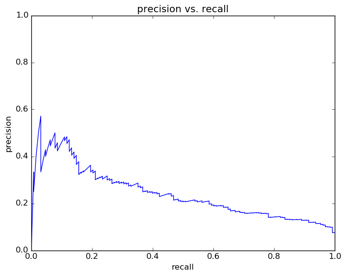
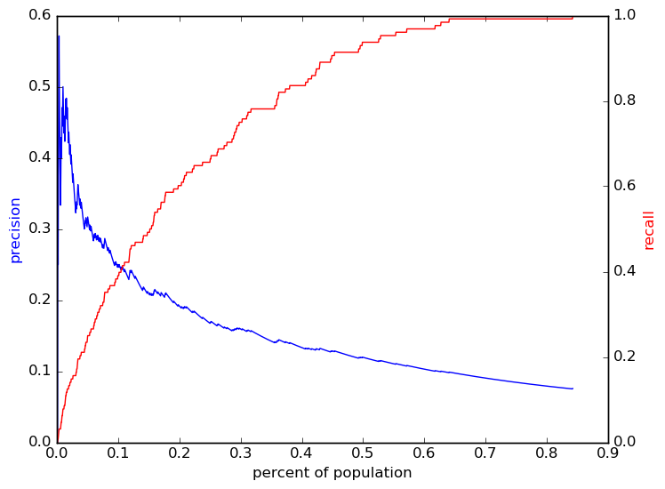
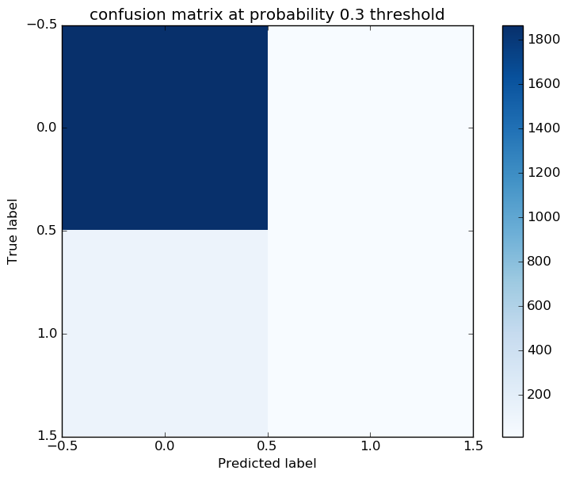
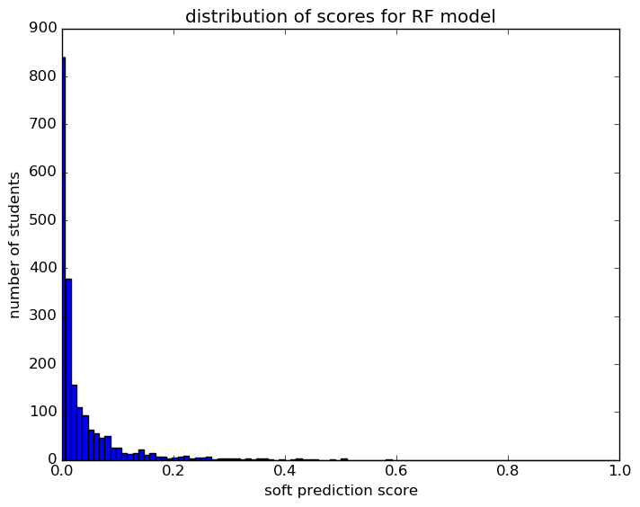

# Report for wk G10 allFeatures 3 RF
weekly update Grade 10 model (xc)

### Model Options
* label used: definite
* initial cohort grade: 9
* test cohorts: 2011
	 * 128 positive examples, 1881 negative examples
* train cohorts: 2008, 2009, 2010
	 * 96 postive examples, 3046 negative examples
* cross-validation scheme: leave cohort out
	 * searching max_depth in 10, 50
	 * chose max_depth = 10
	 * searching min_samples_split in 5, 10
	 * chose min_samples_split = 5
	 * searching n_estimators in 500
	 * chose n_estimators = 500
	 * searching max_features in sqrt
	 * chose max_features = sqrt
	 * using custom_precision_3
* imputation strategy: median plus dummies
* scaling strategy: robust

### Features Used
* demographics
	 * gender
	 * ethnicity
* grades
	 * gpa_gr_9
* oaa_normalized
	 * eighth_math_normalized
	 * eighth_science_normalized
	 * eighth_read_normalized
* snapshots
	 * days_absent_gr_9
	 * special_ed_gr_9
	 * disadvantagement_gr_9
	 * iss_gr_9
	 * oss_gr_9
	 * status_gr_9
	 * district_gr_9
	 * disability_gr_9
	 * gifted_gr_9
	 * discipline_incidents_gr_9
	 * days_absent_unexcused_gr_9
	 * limited_english_gr_9

### Performance Metrics
on average, model run in 7.30 seconds (4 times)  precision on top 15%: 0.2079  precision on top 10%: 0.2488  precision on top 5%: 0.3168  recall on top 15%: 0.4922  recall on top 10%: 0.3906  recall on top 5%: 0.25  AUC value is: 0.8231  

