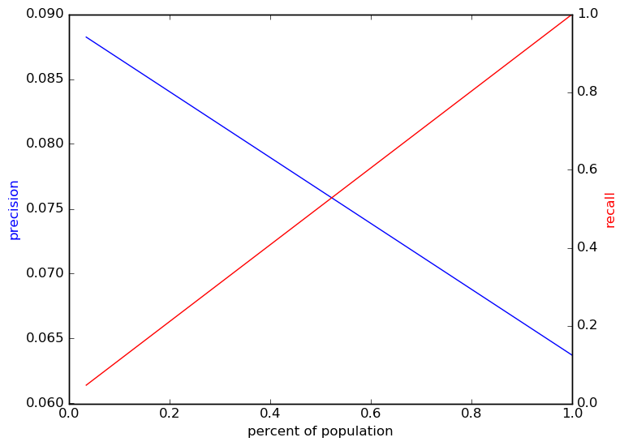
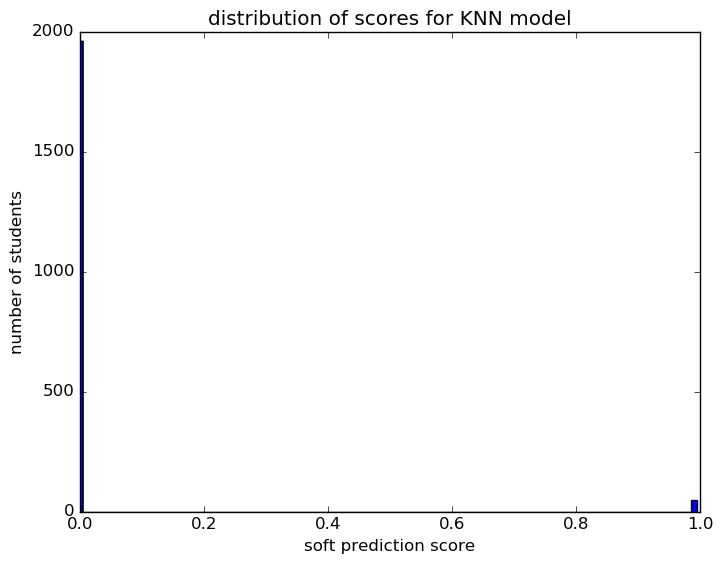
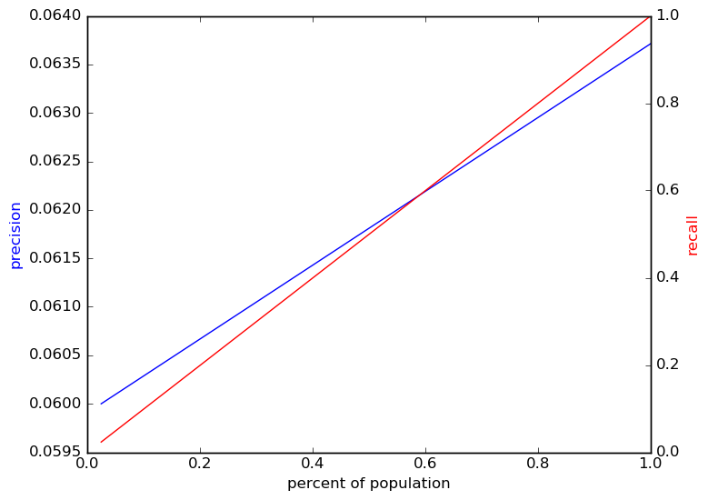
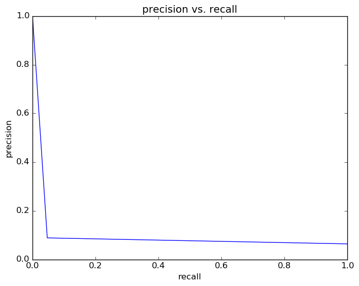
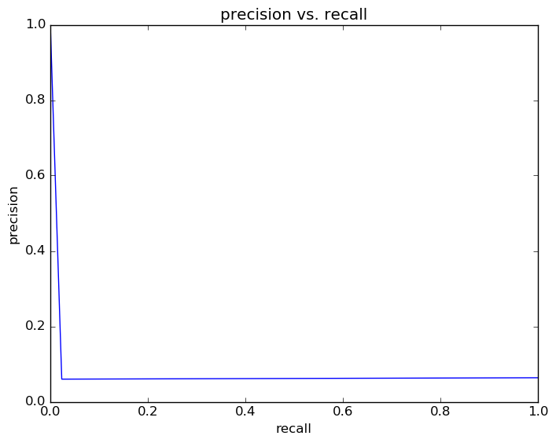
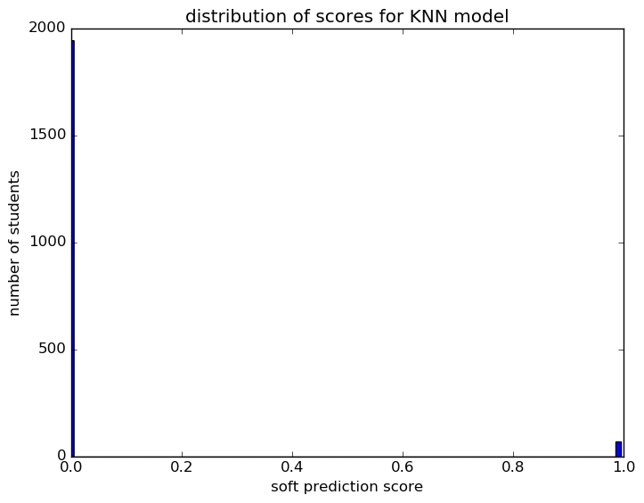
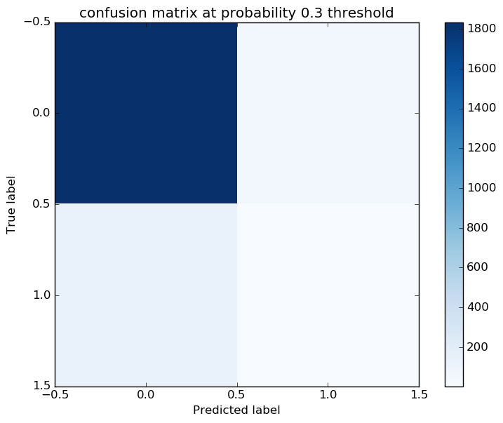

# Report for wk G10 allFeatures KNN
weekly update Grade 10 model (xc)

### Model Options
* label used: definite
* initial cohort grade: 9
* test cohorts: 2011
	 * 128 positive examples, 1881 negative examples
* train cohorts: 2008, 2009, 2010
	 * 96 postive examples, 3046 negative examples
* cross-validation scheme: leave cohort out
	 * searching weights in uniform, distance
	 * chose weights = uniform
	 * searching algorithm in auto, ball_tree, kd_tree
	 * chose algorithm = auto
	 * searching n_neighbors in 1, 5, 10, 25, 50
	 * chose n_neighbors = 1
	 * using custom_precision_10
* imputation strategy: median plus dummies
* scaling strategy: robust

### Features Used
* grades
	 * gpa_gr_9
* mobility
	 * district_transition_in_gr_9
	 * mid_year_withdraw_gr_9
	 * n_addresses_to_gr_9
	 * n_cities_to_gr_9
	 * avg_address_change_to_gr_9
	 * city_transition_in_gr_9
	 * street_transition_in_gr_9
	 * avg_city_change_to_gr_9
	 * n_districts_to_gr_9
	 * n_records_to_gr_9
	 * avg_district_change_to_gr_9
* snapshots
	 * disadvantagement_gr_9
	 * special_ed_gr_9
	 * status_gr_9
	 * days_absent_gr_9
	 * discipline_incidents_gr_9
	 * gifted_gr_9
	 * limited_english_gr_9
	 * iss_gr_9
	 * district_gr_9
	 * oss_gr_9
	 * days_absent_unexcused_gr_9
	 * disability_gr_9
* oaa_normalized
	 * eighth_math_normalized
	 * eighth_read_normalized
	 * eighth_science_normalized
* demographics
	 * ethnicity
	 * gender

### Performance Metrics
on average, model run in 1.31 seconds (30 times)  precision on top 15%: 0.06371  precision on top 10%: 0.06371  precision on top 5%: 0.06371  recall on top 15%: 1.0  recall on top 10%: 1.0  recall on top 5%: 1.0  AUC value is: 0.5156  

